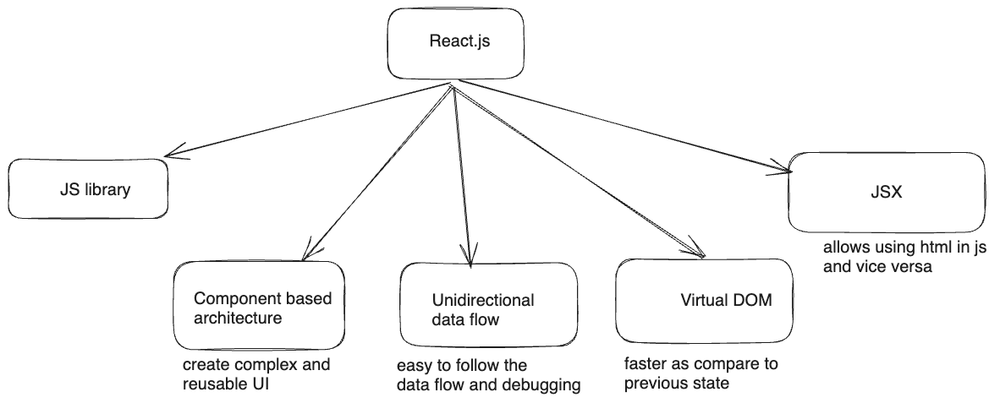

# React Documentation

- prerequisities: HTML, CSS, Javascript
- [React.js official Site](https://reactjs.org/)
- some API for http requests
      - [dummy json](https://dummyjson.com/)
      - [pagination testing](https://reqres.in/api/users?page=2)

## Table of Contents

1. [Basic React.js Topics](#1-basic-reactjs-topics)

   [1.1 Introduction to React](#11-introduction-to-react)

   [1.2 JSX and JS Expression](#12-jsx-and-js-expression)

   [1.3 Component](#13-component)

   [1.4 Adding CSS & SASS Styling](#14-adding-css--sass-styling)

   [1.5 Props and destructuring](#15-props-and-destructuring)

   [1.6 prop-types](#16-prop-types)

   [1.7 Mapping components](#17-mapping--rednering-components)

   [1.8 Conditional rendering](#18-conditional-rendering)
  
   [1.9 developer tools, react and font-awesome icons](#19-developer-tools-react-and-font-awesome-icons)

   [1.10 Adding Interactivity - event & event handler](#110-adding-interactivity---event--event-handler)

   [1.11 useState Hooks](#111-usestate-hooks)

   [1.12 Controlled components and Form](#112-controlled-components-and-form)

   [1.13 Form Validation](#113-form-validation)

   [1.14 data passing: child to parent component, state lifting](#114-data-passing-child-to-parent-component-state-lifting)

   [1.15 useRef hook - Uncontrolled component](#115-useref-hook---uncontrolled-component)

   [1.16 dynamic styling in React](#116-dynamic-styling-in-react)

   [1.17 class component](#117-class-component)

   [1.18 state, setState, event handler](#118-state-setstate-event-handler)

   [1.19 react todo projects](#119-react-todo-projects)

2. [Intermediate React.js Topics](#2-intermediate-reactjs-topics)

    [2.1 life cycle methods of a class component](#21-life-cycle-methods-of-a-class-component)

    [2.2 useEffect Hook](#22-useeffect-hook)

    [2.3 useReducer Hook](#23-usereducer-hook)

    [2.4 Routing](#24-routing)

    [2.5 CRUD Operations - http methods - user management app](#25-crud-operations---http-methods---user-management-app)

    [2.6 Optimization memo, useCallback and useMemo](#26-optimization-reactmemo-usecallback-usememo)

    [2.7 props drilling, useContext Hook](#27-props-drilling-usecontext-hook)

3. [Advanced React.js Topics (coming soon)]

4. Assignments

   [All React Assignments are here](https://github.com/anisul-Islam/all-react-assignments)

   [Assignment 1: product listing App](https://github.com/anisul-Islam/react-assignment-1-products-listing-app)

   [Assignment 2: Counter App](https://github.com/anisul-Islam/react-assignment-2-counter-app)

   [Assignment 3: Add New Product](https://github.com/anisul-Islam/react-assignment-3-add-new-product)

   [Assignment 4: fetch products](https://github.com/anisul-Islam/react-assignment-4-fetch-products)
   
   [Assignment 5: fetch users](https://github.com/anisul-Islam/react-assignment-4-users-management-app)

   [Assignment-6](https://github.com/anisul-Islam/react-assignment-5-users-management-app-2?tab=readme-ov-file)

## 1. Basic React.js Topics

### [1.1 Introduction to React](https://youtu.be/fRXL0X2WSK4)

#### What is React?

- React is an open-source JavaScript library for building user interfaces. It was developed in 2013 and is maintained by Facebook. React is known for its performance, flexibility, and component-based architecture, which allows developers to build reusable UI components and efficiently manage the state of an application.

#### Why React / Features of React.js

- high demand for front-end jobs
- you can build mobile (react native), desktop (Electron) and web application
- Electron is a framework for building desktop applications using web technologies such as JavaScript, HTML, and CSS. It can be used as the runtime environment for a React application. Electron allows React applications to run on desktop operating systems such as Windows, macOS, and Linux.



Here are some key features and concepts associated with React:

  1. **Component-Based:** React applications are built using components, which are self-contained, reusable building blocks for user interfaces. It helps us to create reusable components (small and isolated pieces of code using html, css, js). It helps us to render UI. Think about youtube's website
      - Single Page Application (SPA) allows us to render as much as we need for reducing unnecessary rendering such as loading navbar, footer etc. in all the pages
      - think about html tag and creating your own tag with react

  2. **Virtual DOM:** React uses a virtual representation of the DOM (Document Object Model) to optimize updates. Instead of directly manipulating the actual DOM, React compares changes in the virtual DOM and efficiently updates only the necessary parts of the real DOM, reducing rendering time and improving performance.
      - Load fast - Why React.js is faster? - virtual DOM compares with previous states

  3. **Declarative Syntax:** React uses a declarative approach to building UIs. Developers describe what the UI should look like based on the application's state, and React takes care of updating the DOM to match that state.

  4. **Unidirectional Data Flow:** React enforces a one-way data flow, which means data flows down the component hierarchy from parent components to child components. This helps maintain predictable and debugable code.

  5. **JSX (JavaScript XML):** React allows you to write UI components using JSX, which is a syntax extension for JavaScript. JSX allows you to write HTML-like code within your JavaScript files, making it easier to define UI elements.

  6. **Component Lifecycle:** React components have lifecycle methods that allow developers to hook into specific points in a component's lifecycle, such as when it's mounted or updated. This is useful for performing actions like data fetching, initialization, or cleanup.

  7. **State Management:** React provides a mechanism for managing component-specific state using the `useState` hook for functional components and `setState` for class components. For global state management, libraries like Redux or React Context can be used.

  8. **Routing:** React can be used in combination with routing libraries like React Router to create single-page applications with client-side routing.

  9. **Community and Ecosystem:** React has a large and active community, which has led to the development of a rich ecosystem of third-party libraries and tools to enhance development and improve productivity.

  10. **Example of React app and competitors** - facebook, twitter, airbnb, netflix etc. competitor: Vue.js, Angular (more full-fledged / developed no need 3rd party library just like react-router-dom)

  Overall, React is a powerful and popular choice for building modern web applications, and it's widely adopted by developers and organizations for its efficiency and developer-friendly approach to UI development.

#### Prerequisites

- HTML, CSS, JS

#### [Environment setup](https://youtu.be/4wjI8fh77GM)

- VSCode (code editor)
- node.js (Download LTS: Long Term Support one)
  (npm is included in node.js by default)
- React Developer tools extensions for google, firefox, edge
- Extension: ES7 react, JS JSX snippets + “editior.snipperSuggestions”: “top”, react developer tools, material theme, setup eslint and prettier

#### [First react app](https://youtu.be/_yYO_ly9hmY?si=ruoWbevzoJrj0pqS)

Method 1: create and run react app with npx

```js
// create react app command
npx create-react-app appName

// run react app command
cd appName
npm start
```

Method 2: create react app with bundler with vite `npm create vite@latest` swc(speedy web compiler)

- `npx create vite@latest . --template react`

#### Code Example - 1 (create React app)

  ```jsx
    // Code Example - 1 (create React app)
    import React from 'react';
    import ReactDOM from 'react-dom/client';

    ReactDOM.createRoot(document.getElementById('root')).render(
      <React.StrictMode>
        Anis Express
      </React.StrictMode>
    );
  ```

#### Understand File structure

- discuss about package.json, node_modules, public, src
- [package-lock.json](https://medium.com/helpshift-engineering/package-lock-json-the-complete-guide-2ae40175ebdd#:~:text=different%20machines%2Fenvironments.-,package%2Dlock.,json%20file.) is for version control for packages. it keeps the record of node_modules tree so that when you clone and use npm i it will install exactly same versions for the packages even though their is a new versions. if you do not have package-lock.json then it will install from package.json
- keep only the index.js in src and then play with React.js
- change the title of the app inside index.html file

<!-- ## Part-2 (JSX, Component, react component under the hood, Styling, Props, PropTypes, Conditional rendering, Fragment, react dev-tools, icons) -->

### [1.2 JSX and JS Expression](https://youtu.be/6-r6pBA4eUY)

**JSX: stands for JavaScript XML which allows us to use write html-like syntax inside javascript and vice versa**. react module has babbel inside of it that helps us to run jsx. JSX is similar like HTML but it is more dynamic. JSX and React are independent things and they can be used independently.

#### Rules for JSX

1. **We can return single element using JSX, for multiple elements we can use a wrapper. We can also use Fragment here.**

    - why we can not return multiple elements in JSX needs to be rendered?
      jsx is javascript object and we can not return 2 objects from a function so we need to use array syntax and wrap everything inside one array.

      - Code Example - 2 (render single element)

      ```js
      // Code Example - 2 (render single element)
      import React from "react";
      import ReactDOM from "react-dom/client";

      const root = ReactDOM.createRoot(document.getElementById("root"));
      root.render(<h1>Anis Express</h1>);
      ```

    - **React render function can render only one element**

      ```jsx
      // Code Example - 3 (Rendering multiple elements)
      import React from 'react';
      import ReactDOM from 'react-dom/client';

      ReactDOM.createRoot(document.getElementById('root')).render(
        <React.StrictMode>
          <div>
            <header>
              <h1>Anis Express</h1>
            </header>
            <main>
               <aside>
                  <h3>Add Filter By Price</h3>
                  <h3>Add Filter By Categories</h3>
                </aside>
              <section>
                <article>product info goes here</article>
              </section>
            </main>
            <footer>
              <p>Copyright by @Anisul Islam</p>
            </footer>
          </div>
        </React.StrictMode>
      );
      ```

    - **React.Fragment or <> </> helps us to avoid div soup or unnecessary div nesting.**

        ```js
        // Code Example - 4 (Fragment)
        import React, {Fragment} from 'react';

        import ReactDOM from 'react-dom/client';

        ReactDOM.createRoot(document.getElementById('root')).render(
          <React.StrictMode>
            <Fragment>
              <header>
                <h1>Anis Express</h1>
              </header>
              <main>
                 <aside>
                    <h3>Add Filter By Price</h3>
                    <h3>Add Filter By Categories</h3>
                  </aside>
                <section>
                  <article>product info goes here</article>
                </section>
              </main>
              <footer>
                <p>Copyright by @Anisul Islam</p>
              </footer>
            </Fragment>
          </React.StrictMode>
        );

        ```

2. **Remember to close all tags - ``**

3. **Camelcase - className, FunctionName**

#### We can use Javascript expression inside JSX

  ```js
 // Code Example - 5 (JS Expressions in JSX)

    import React, { Fragment } from 'react';
    import ReactDOM from 'react-dom/client';

    // get 5 products from fakestore api
    export const productsData = [
      {
        id: 1,
        title: 'Fjallraven - Foldsack No. 1 Backpack, Fits 15 Laptops',
        price: 109.95,
        description:
          'Your perfect pack for everyday use and walks in the forest. Stash your laptop (up to 15 inches) in the padded sleeve, your everyday',
        category: "men's clothing",
        image: 'https://fakestoreapi.com/img/81fPKd-2AYL._AC_SL1500_.jpg',
        rating: {
          rate: 3.9,
          count: 120,
        },
      },
      {
        id: 2,
        title: 'Mens Casual Premium Slim Fit T-Shirts ',
        price: 22.3,
        description:
          'Slim-fitting style, contrast raglan long sleeve, three-button henley placket, light weight & soft fabric for breathable and comfortable wearing. And Solid stitched shirts with round neck made for durability and a great fit for casual fashion wear and diehard baseball fans. The Henley style round neckline includes a three-button placket.',
        category: "men's clothing",
        image:
          'https://fakestoreapi.com/img/71-3HjGNDUL._AC_SY879._SX._UX._SY._UY_.jpg',
        rating: {
          rate: 4.1,
          count: 259,
        },
      },
      {
        id: 3,
        title: 'Mens Cotton Jacket',
        price: 55.99,
        description:
          'great outerwear jackets for Spring/Autumn/Winter, suitable for many occasions, such as working, hiking, camping, mountain/rock climbing, cycling, traveling or other outdoors. Good gift choice for you or your family member. A warm hearted love to Father, husband or son in this thanksgiving or Christmas Day.',
        category: "men's clothing",
        image: 'https://fakestoreapi.com/img/71li-ujtlUL._AC_UX679_.jpg',
        rating: {
          rate: 4.7,
          count: 500,
        },
      },
      {
        id: 4,
        title: 'Mens Casual Slim Fit',
        price: 15.99,
        description:
          'The color could be slightly different between on the screen and in practice. / Please note that body builds vary by person, therefore, detailed size information should be reviewed below on the product description.',
        category: "men's clothing",
        image: 'https://fakestoreapi.com/img/71YXzeOuslL._AC_UY879_.jpg',
        rating: {
          rate: 2.1,
          count: 430,
        },
      },
      {
        id: 5,
        title:
          "John Hardy Women's Legends Naga Gold & Silver Dragon Station Chain Bracelet",
        price: 695,
        description:
          "From our Legends Collection, the Naga was inspired by the mythical water dragon that protects the ocean's pearl. Wear facing inward to be bestowed with love and abundance, or outward for protection.",
        category: 'jewelery',
        image: 'https://fakestoreapi.com/img/71pWzhdJNwL._AC_UL640_QL65_ML3_.jpg',
        rating: {
          rate: 4.6,
          count: 400,
        },
      },
    ];

    ReactDOM.createRoot(document.getElementById('root')).render(
      <React.StrictMode>
        <Fragment>
          <header>
            <h1>Anis Express</h1>
          </header>
          <main>
            <aside>
              <h3>Add Filter By Price</h3>
              <h3>Add Filter By Categories</h3>
            </aside>
            <section>
              <article>
                
                <h2>{productsData[0].id}</h2>
                <p>{productsData[0].title}</p>
                <p>{productsData[0].description}</p>
                <p>Price: {productsData[0].price}</p>
                <p>Category: {productsData[0].category}</p>
                <p>Rating: {productsData[0].rating.rate}/5</p>
              </article>

              <article>
                
                <h2>{productsData[1].id}</h2>
                <p>{productsData[1].title}</p>
                <p>{productsData[1].description}</p>
                <p>Price: {productsData[1].price}</p>
                <p>Category: {productsData[1].category}</p>
                <p>Rating: {productsData[1].rating.rate}/5</p>
              </article>
            </section>
          </main>
          <footer>
            <p>Copyright by @Anisul Islam</p>
          </footer>
        </Fragment>
      </React.StrictMode>
    );
  ```

### [1.3 Component](https://youtu.be/qgLZSNppJOU)

- **Component: A _reusable_, _nestable_ _building block_ constrcut with mainly Javascript function and HTML; CSS can be added**
  - Component VS Function: Component should always start with capital letter and return JSX
  - There are 2 main types of components: functional component and class component
  - keep a blank line when importing your components for separating built in modules

  ```jsx
  // Code Example 6 - Create a reusable functional component for Header, Sidebar, Footer, Products, 
  
  // Create App.jsx component and move everything there and start doing decomposition

  // Create Page: pages/Home.jsx page

  // components/Header.jsx
  import React from 'react';
  const Header = () => {
    return (
      <header>
        <h1>Anis Express</h1>
      </header>
    );
  };
  export default Header;

  // components/Sidebar.jsx
  import React from 'react';
  const Sidebar = () => {
    return (
      <aside>
        <h3>Add Filter By Price</h3>
        <h3>Add Filter By Categories</h3>
      </aside>
    );
  };
  export default Sidebar;

  // components/Products.jsx
  import React from 'react';

  export const productsData = [
    {
      id: 1,
      title: 'Fjallraven - Foldsack No. 1 Backpack, Fits 15 Laptops',
      price: 109.95,
      description:
        'Your perfect pack for everyday use and walks in the forest. Stash your laptop (up to 15 inches) in the padded sleeve, your everyday',
      category: "men's clothing",
      image: 'https://fakestoreapi.com/img/81fPKd-2AYL._AC_SL1500_.jpg',
      rating: {
        rate: 3.9,
        count: 120,
      },
    },
    {
      id: 2,
      title: 'Mens Casual Premium Slim Fit T-Shirts ',
      price: 22.3,
      description:
        'Slim-fitting style, contrast raglan long sleeve, three-button henley placket, light weight & soft fabric for breathable and comfortable wearing. And Solid stitched shirts with round neck made for durability and a great fit for casual fashion wear and diehard baseball fans. The Henley style round neckline includes a three-button placket.',
      category: "men's clothing",
      image:
        'https://fakestoreapi.com/img/71-3HjGNDUL._AC_SY879._SX._UX._SY._UY_.jpg',
      rating: {
        rate: 4.1,
        count: 259,
      },
    },
    {
      id: 3,
      title: 'Mens Cotton Jacket',
      price: 55.99,
      description:
        'great outerwear jackets for Spring/Autumn/Winter, suitable for many occasions, such as working, hiking, camping, mountain/rock climbing, cycling, traveling or other outdoors. Good gift choice for you or your family member. A warm hearted love to Father, husband or son in this thanksgiving or Christmas Day.',
      category: "men's clothing",
      image: 'https://fakestoreapi.com/img/71li-ujtlUL._AC_UX679_.jpg',
      rating: {
        rate: 4.7,
        count: 500,
      },
    },
    {
      id: 4,
      title: 'Mens Casual Slim Fit',
      price: 15.99,
      description:
        'The color could be slightly different between on the screen and in practice. / Please note that body builds vary by person, therefore, detailed size information should be reviewed below on the product description.',
      category: "men's clothing",
      image: 'https://fakestoreapi.com/img/71YXzeOuslL._AC_UY879_.jpg',
      rating: {
        rate: 2.1,
        count: 430,
      },
    },
    {
      id: 5,
      title:
        "John Hardy Women's Legends Naga Gold & Silver Dragon Station Chain Bracelet",
      price: 695,
      description:
        "From our Legends Collection, the Naga was inspired by the mythical water dragon that protects the ocean's pearl. Wear facing inward to be bestowed with love and abundance, or outward for protection.",
      category: 'jewelery',
      image: 'https://fakestoreapi.com/img/71pWzhdJNwL._AC_UL640_QL65_ML3_.jpg',
      rating: {
        rate: 4.6,
        count: 400,
      },
    },
  ];

  const Products = () => {
    return (
      <section>
        <article>
          
          <h2>{productsData[0].id}</h2>
          <p>{productsData[0].title}</p>
          <p>{productsData[0].description.substring(0,50)...}</p>
          <p>Price: {productsData[0].price}</p>
          <p>Category: {productsData[0].category}</p>
          <p>Rating: {productsData[0].rating.rate}/5</p>
        </article>

        <article>
          
          <h2>{productsData[1].id}</h2>
          <p>{productsData[1].title}</p>
          <p>{productsData[0].description.substring(0,50)...}</p>
          <p>Price: {productsData[1].price}</p>
          <p>Category: {productsData[1].category}</p>
          <p>Rating: {productsData[1].rating.rate}/5</p>
        </article>
      </section>
    );
  };
  export default Products;

  // components/Footer.jsx
  import React from 'react';
  const Footer = () => {
    return (
      <footer>
        <p>Copyright by @Anisul Islam</p>
      </footer>
    );
  };
  export default Footer;

  // Home.jsx
  import React from 'react';

  import Sidebar from '../components/Sidebar';
  import Products from '../components/Products';
  const Home = () => {
    return (
      <div>
        <Sidebar />
        <div>
          <Products />
        </div>
      </div>
    );
  };
  export default Home;

  // App.jsx
  import React, { Fragment } from 'react';

  import Sidebar from './components/Sidebar';
  import Products from './components/Products';
  import Footer from './components/Footer';
  import Header from './components/Header';

  const App = () => {
    return (
      <Fragment>
        <Header />
        <main>
         <Home/>
        </main>
        <Footer />
      </Fragment>
    );
  };
  export default App;
  ```

#### Code Example - 7 (export, import modular component)

- export default can be used once in a file where multiple exports can be used
- importing export default does not require {} and you can name anything on the other hand only exports requires {} and naming is strict

```js
// src/data.js
export const productsData = [
  {
    id: 1,
    title: 'Fjallraven - Foldsack No. 1 Backpack, Fits 15 Laptops',
    price: 109.95,
    description:
      'Your perfect pack for everyday use and walks in the forest. Stash your laptop (up to 15 inches) in the padded sleeve, your everyday',
    category: "men's clothing",
    image: 'https://fakestoreapi.com/img/81fPKd-2AYL._AC_SL1500_.jpg',
    rating: {
      rate: 3.9,
      count: 120,
    },
  },
  {
    id: 2,
    title: 'Mens Casual Premium Slim Fit T-Shirts ',
    price: 22.3,
    description:
      'Slim-fitting style, contrast raglan long sleeve, three-button henley placket, light weight & soft fabric for breathable and comfortable wearing. And Solid stitched shirts with round neck made for durability and a great fit for casual fashion wear and diehard baseball fans. The Henley style round neckline includes a three-button placket.',
    category: "men's clothing",
    image:
      'https://fakestoreapi.com/img/71-3HjGNDUL._AC_SY879._SX._UX._SY._UY_.jpg',
    rating: {
      rate: 4.1,
      count: 259,
    },
  },
  {
    id: 3,
    title: 'Mens Cotton Jacket',
    price: 55.99,
    description:
      'great outerwear jackets for Spring/Autumn/Winter, suitable for many occasions, such as working, hiking, camping, mountain/rock climbing, cycling, traveling or other outdoors. Good gift choice for you or your family member. A warm hearted love to Father, husband or son in this thanksgiving or Christmas Day.',
    category: "men's clothing",
    image: 'https://fakestoreapi.com/img/71li-ujtlUL._AC_UX679_.jpg',
    rating: {
      rate: 4.7,
      count: 500,
    },
  },
  {
    id: 4,
    title: 'Mens Casual Slim Fit',
    price: 15.99,
    description:
      'The color could be slightly different between on the screen and in practice. / Please note that body builds vary by person, therefore, detailed size information should be reviewed below on the product description.',
    category: "men's clothing",
    image: 'https://fakestoreapi.com/img/71YXzeOuslL._AC_UY879_.jpg',
    rating: {
      rate: 2.1,
      count: 430,
    },
  },
  {
    id: 5,
    title:
      "John Hardy Women's Legends Naga Gold & Silver Dragon Station Chain Bracelet",
    price: 695,
    description:
      "From our Legends Collection, the Naga was inspired by the mythical water dragon that protects the ocean's pearl. Wear facing inward to be bestowed with love and abundance, or outward for protection.",
    category: 'jewelery',
    image: 'https://fakestoreapi.com/img/71pWzhdJNwL._AC_UL640_QL65_ML3_.jpg',
    rating: {
      rate: 4.6,
      count: 400,
    },
  },
];

// components/Products.js
import React from 'react';

import { productsData } from '../data';

const Products = () => {
  return (
    <section>
      <article>
        
        <h2>{productsData[0].id}</h2>
        <p>{productsData[0].title}</p>
        <p>{productsData[0].description}</p>
        <p>Price: {productsData[0].price}</p>
        <p>Category: {productsData[0].category}</p>
        <p>Rating: {productsData[0].rating.rate}/5</p>
      </article>

      <article>
        
        <h2>{productsData[1].id}</h2>
        <p>{productsData[1].title}</p>
        <p>{productsData[1].description}</p>
        <p>Price: {productsData[1].price}</p>
        <p>Category: {productsData[1].category}</p>
        <p>Rating: {productsData[1].rating.rate}/5</p>
      </article>
    </section>
  );
};

export default Products;
```

#### [How React works under the hood](https://youtu.be/kj0cxv_dC9M)

- **Code Example - 8 (React under the hood)**

```javascript
const Message = () => {
  // return <h3>Message </h3>;
  return React.createElement("h1", {}, "welcome");
};

const Todo = () => {
  return (
    // <article>
    //   <h2>Check students attendance</h2>
    //   <p>
    //     Lorem ipsum dolor sit amet consectetur adipisicing elit. Ab, molestiae.
    //   </p>
    // </article>

    React.createElement(
      "article",
      {},
      React.createElement("h2", {}, "Check students attendance"),
      React.createElement(
        "p",
        {},
        " Lorem ipsum dolor sit amet consectetur adipisicing elit. Ab, molestiae."
      )
    )
  );
};
```

### [1.4 Adding CSS & SASS Styling](https://youtu.be/02YWKDxLpwk)

- **DO NOT FOCUS ON STYLING CAUSE IT IS NOT A CSS OR STYLING SERIES. Copy the css code and paste it.**

- 1. Inline styling

    ```js
      const headingStyle = { color: 'red', fontSize: '3rem' };
      <aside style={headingStyle}>
        sidebar goes here
      </aside>
    ```

- 2. CSS Stylesheet / global CSS

  - **Code Example - 9 (Styling component with CSS)**

    ```css
      /*reset code and common ends here*/

     /* reset and common styles */

      :root {
        --primary-color: #4CAF50;
        --secondary-color: #2E7D32;
        --background-color: #f5f5f5;
        --text-color: #333;
        --padding: 1rem;
        --transition: all 0.3s ease;
        --border-radius: 0.5rem;
        --box-shadow: 0 4px 8px rgba(0, 0, 0, 0.1);
      }

      - {
        box-sizing: border-box;
        margin: 0;
        padding: 0;
        text-decoration: none;
        list-style: none;
        outline: none;
      }

      body {
        font-family: 'Arial', sans-serif;
        background-color: var(--background-color);
        color: var(--text-color);
        margin: 0;
      }

      h1, h2, h3, p {
        margin-bottom: 1rem;
      }

      img {
        max-width: 100%;
        display: block;
        border-radius: var(--border-radius);
      }


      html {
        scroll-behavior: smooth;
      }

      .flex-space-around {
        display: flex;
        justify-content: space-around;
        align-items: center;
      }

      .flex-center {
        display: flex;
        justify-content: center;
        align-items: center;
      }

      img {
        width: 100%;
        height: auto;
        object-fit: contain;
      }

      /_reset code and common ends here_/

      /_header starts here_/
      .header {
        height: 10vh;
        background-color: var(--primary-color);
        color: white;
        display: flex;
        align-items: center;
        justify-content: space-between;
        padding: 0 2rem;
      }
      /_header ends here_/

      /_main starts here_/
      main {
        height: 80vh;
        padding: 2rem;
        overflow: scroll;
      }

      .container {
        display: flex;
        gap: 2rem;
      }

      .sidebar {
        flex: 1;
        padding: var(--padding);
        display: flex;
        flex-direction: column;
        gap: 1rem;
        background-color: white;
        border: 1px solid var(--primary-color);
        border-radius: var(--border-radius);
        box-shadow: var(--box-shadow);
      }

      .main-content {
        flex: 3;
        padding: var(--padding);
      }

      .products {
        display: grid;
        /* grid-template-columns: repeat(3, minmax(0, 1fr)); */
        grid-template-columns: repeat(auto-fit, minmax(250px, 1fr));
        gap: 2rem;
        padding: 1rem;
      }


     /* Card component styles */

      .card {
        background-color: white;
        border-radius: var(--border-radius);
        box-shadow: var(--box-shadow);
        overflow: hidden;
        transition: var(--transition);
      }

      .card:hover {
        transform: scale(1.02);
      }


      .product__img {
        width: 100%;
        height: 15rem;
        object-fit: cover;
        border-radius: var(--border-radius);
      }

      .product__title {
        font-size: 1.2rem;
        font-weight: bold;
        margin: 0.5rem 0;
      }

      .product__description {
        font-size: 0.9rem;
        color: var(--secondary-color);
        margin: 0.5rem 0;
      }

      .product__price {
        font-size: 1rem;
        color: var(--primary-color);
        font-weight: bold;
        margin: 0.5rem 0;
      }

      .button {
        background-color: var(--primary-color);
        color: white;
        padding: 0.5rem 1rem;
        border: none;
        border-radius: var(--border-radius);
        cursor: pointer;
        transition: var(--transition);
      }

      .button:hover {
        background-color: var(--secondary-color);
      }
      /_main ends here_/

      /_footer starts here_/
      .footer {
        height: 10vh;
        padding: var(--padding);
        background-color: var(--primary-color);
        color: white;
        font-size: 1.1rem;
        display: flex;
        justify-content: space-between;
        align-items: center;
        padding: 0 2rem;
      }

      .footer a {
        color: white;
        font-weight: bold;
      }

      .footer .social-media a {
        margin: 0 0.5rem;
        font-size: 1.2rem;
      }
      /_footer ends here_/

      /_responsiveness starts here_/
      @media (max-width: 992px) {
        .flex-space-around,
        .flex-center {
          flex-direction: column;
          gap: 1rem;
        }
        .header {
          flex-direction: column;
          padding: 1rem 0;
        }
        .sidebar {
          width: 100%;
        }
        .products {
          grid-template-columns: repeat(2, minmax(0, 1fr));
        }
      }

      @media (max-width: 768px) {
        .products {
          grid-template-columns: repeat(1, minmax(0, 1fr));
        }
      }
      /_responsiveness ends here_/
    ```

    ```jsx
     // Code Example - 9 (Styling component with CSS)
      import React from 'react';

      import Sidebar from '../components/Sidebar';
      import Products from '../components/Products';

      const Home = () => {
        return (
          <div className="container flex-space-around">
            <Sidebar />
            <div className="main-content">
              <Products />
            </div>
          </div>
        );
      };

      export default Home;
    ```

- 3. CSS module: create a file name such as fileName.module.css as shown below

  CSS Modules offer a robust solution for styling React components by providing scoped styles, preventing global namespace pollution, and making it easier to maintain and manage styles in large applications. They align well with the modular nature of React components and help ensure that styles are predictable and encapsulated.

  - Benefits of Using CSS Modules in React

      1. **Scoped Styles**:
        - CSS Modules automatically scope the CSS to the component it is imported into. This prevents styles from one component from unintentionally affecting styles in another component.
        - This is particularly useful in large applications where naming conflicts can be a common issue.

      2. **Avoid Global Namespace**:
        - Traditional CSS is global, meaning that all class names are in the global namespace. CSS Modules mitigate this by generating unique class names for each component, thus avoiding the risk of naming conflicts.

      3. **Easier Maintenance**:
        - Scoped styles make it easier to maintain and update the CSS for individual components without worrying about side effects on other parts of the application.
        - This modular approach aligns with the component-based architecture of React.

      4. **Improved Readability**:
        - CSS Modules can lead to better-organized code. Styles are co-located with the component logic, making it easier to see how a component is styled without needing to search through a large, separate CSS file.

      5. **Dynamic Class Names**:
        - CSS Modules support dynamic class names, allowing you to conditionally apply styles based on component state or props.
        - This can simplify the process of applying different styles based on user interaction or other conditions.

      6. **Integration with CSS Preprocessors**:
        - CSS Modules can be used with CSS preprocessors like Sass or Less, allowing you to leverage their features (e.g., variables, mixins) while still benefiting from scoped styles.

  - How to Use CSS Modules in React

    1. **Create a CSS Module File**:
      Create a CSS file with the `.module.css` extension (e.g., `Button.module.css`).

      ```css
      /* Button.module.css */
      .button {
        background-color: #4caf50;
        color: white;
        padding: 10px 20px;
        border: none;
        border-radius: 5px;
        cursor: pointer;
      }

      .button:hover {
        background-color: #45a049;
      }
      ```

    2. **Import and Use the CSS Module in a React Component**:
      Import the CSS Module into your React component and use it.

      ```jsx
      // Button.js
      import React from 'react';
      import styles from './Button.module.css';

      const Button = ({ children, onClick }) => {
        return (
          <button className={styles.button} onClick={onClick}>
            {children}
          </button>
        );
      };

      export default Button;
      ```

    3. **Dynamic Class Names**:
      You can conditionally apply class names using the `classnames` library or template literals.

      ```jsx
      import React from 'react';
      import styles from './Button.module.css';
      import classnames from 'classnames';

      const Button = ({ children, onClick, primary }) => {
        return (
          <button
            className={classnames(styles.button, {
              [styles.primary]: primary
            })}
            onClick={onClick}
          >
            {children}
          </button>
        );
      };

      export default Button;
      ```

  - adding multiple class in modules
  In React, when using CSS Modules, you can add multiple class names to an element by combining them using the `classnames` library or by using template literals. Both approaches allow you to conditionally apply multiple class names based on certain conditions.

    - Using the `classnames` Library

    The `classnames` library is a popular utility for conditionally combining class names. It simplifies the process of adding multiple classes and is particularly useful when you need to apply classes conditionally.

    1. **Install the `classnames` Library**:

      You can install the `classnames` library via npm or yarn:

      ```bash
      npm install classnames
      ```

      or

      ```bash
      yarn add classnames
      ```

    2. **Combine Classes Using `classnames`**:

      Here’s an example demonstrating how to use `classnames` with CSS Modules:

      ```jsx
      // Button.js
      import React from 'react';
      import classnames from 'classnames';
      import styles from './Button.module.css';

      const Button = ({ children, onClick, primary, secondary }) => {
        const buttonClass = classnames(styles.button, {
          [styles.primary]: primary,
          [styles.secondary]: secondary,
        });

        return (
          <button className={buttonClass} onClick={onClick}>
            {children}
          </button>
        );
      };

      export default Button;
      ```

      ```css
      /* Button.module.css */
      .button {
        padding: 10px 20px;
        border: none;
        border-radius: 5px;
        cursor: pointer;
      }

      .primary {
        background-color: #4caf50;
        color: white;
      }

      .secondary {
        background-color: #008cba;
        color: white;
      }
      ```

    - Using Template Literals

    If you prefer not to use an additional library, you can also use JavaScript template literals to combine class names.

    1. **Combine Classes Using Template Literals**:

      Here’s an example demonstrating how to use template literals with CSS Modules:

      ```jsx
      // Button.js
      import React from 'react';
      import styles from './Button.module.css';

      const Button = ({ children, onClick, primary, secondary }) => {
        const buttonClass = `${styles.button} ${primary ? styles.primary : ''} ${secondary ? styles.secondary : ''}`;

        return (
          <button className={buttonClass} onClick={onClick}>
          <button className={`${style.title1} ${style.title2}`} onClick={onClick}>
            {children}
          </button>
        );
      };

      export default Button;
      ```

      ```css
      /* Button.module.css */
      .button {
        padding: 10px 20px;
        border: none;
        border-radius: 5px;
        cursor: pointer;
      }

      .primary {
        background-color: #4caf50;
        color: white;
      }

      .secondary {
        background-color: #008cba;
        color: white;
      }
      ```

- 4. SASS
  - [sass official doc](https://sass-lang.com/documentation/)
  - [my sass doc](https://github.com/anisul-Islam/sass-documentation)

  ```bash
    # .scss and .sass

    npm add -D sass

    # .less

    npm add -D less

    # .styl and .stylus

    npm add -D stylus
  ```

  - create scss file

  ```css
    .product {
      background: #000;
      .product__title {
        color: red;
      }
      .product-desc {
        color: green;
      }
    }
  ```

  - use it from component

  ```js
    import React from 'react';
    import PropTypes from 'prop-types';

    import styles from './product.module.scss';

    const Product = (props) => {
      const { product } = props;
      return (
        <article className={styles.product}>
          
          <p className={styles.product__title}>{product.title}</p>
          <p className={styles['product-desc']}> // for accessing kebab case use []
            {product.description.substring(0, 40)}
            ...
          </p>
        </article>
      );
    };

  ```
  
### [1.5 Props and destructuring](https://youtu.be/GQx58yfYqxo)

- **props object: Properties are called as props. we can pass information from one component to another using props object. components communicate with each others via props. props is an object. props are like attributes in our HTML tag. props are readonly**
  - how to pass, receive, set default props
  - how to pass JSX to component,
- **Code Example - 10 (Props sending)**

```js
// component without props is flexible?
import React from 'react';
const Message = () => {
  return <div>Anisul Islam you have received 12 messages</div>;
};
export default Message;

import React, { Fragment } from 'react';
import Message from './components/Message';
const App = () => {
  return (
    <Fragment>
      <Message />
    </Fragment>
  );
};

export default App;

// lets pass data to components
// pass number  num={12}
// pass string num="12"
// pass boolean bool="true"; String(props.bool)
// pass object
// pass array
import React, { Fragment } from 'react';
import Message from './components/Message';
const App = () => {
  return (
    <Fragment>
       <Message numberOfMessages={12} name="Anisul Islam" />
    </Fragment>
  );
};
export default App;

import React from 'react';
const Message = (props) => {
  return (
    <div>{props.name} you have received {props.numberOfMessages} messages</div>
  );
};
export default Message;

// destructure method 1
import React from 'react';
const Message = (props) => {
  const {name, numberOfMessages} = props;
  return (
    <div>{props.name} you have received {props.numberOfMessages} messages</div>
  );
};
export default Message;

// destructure method 2
import React from 'react';
const Message = ({name, numberOfMessages}) => {
  return (
    <div>{props.name} you have received {props.numberOfMessages} messages</div>
  );
};
export default Message;
```

- create data.js in src folder and move all the products dummy data there and import in Home.js for passing it as props to Products component.
- **Code Example - 11 (props and destructure complex example)**

```js
// data.js

// Home.js
import React from 'react';

import Sidebar from '../components/Sidebar';
import Products from '../components/Products';
import { products } from '../data';

const Home = () => {
  return (
    <div className="container flex-space-around">
      <Sidebar />
      <div className="main-content">
        <Products products={products} />
      </div>
    </div>
  );
};
export default Home;


// Products.js
import React from 'react';
const Products = (props) => {
  const { products } = props;

  return (
    <section className="products">
      <article className="product card">
        
        <h2>{products[0].id}</h2>
        <p className="product__title">{products[0].title}</p>
        <p className="product__description">
          {products[0].description.substring(0, 80)}
          ...
        </p>
        <p className="product__price">Price: {products[0].price}</p>
        <p>Category: {products[0].category}</p>
        <p>Rating: {products[0].rating.rate}/5</p>
      </article>

      <article className="product card">
        
        <h2>{products[1].id}</h2>
        <p className="product__title">{products[1].title}</p>
        {products[1].description.substring(0, 80)}...
        <p className="product__price">Price: {products[1].price}</p>
        <p>Category: {products[1].category}</p>
        <p>Rating: {products[1].rating.rate}/5</p>
      </article>
    </section>
  );
};

export default Products;
```

- **Code Example - 12 (more decomposition example)**

```js
// Product.jsx
import React from 'react';

const Product = (props) => {
  const { product } = props;
  return (
    <article className="product card">
      
      <p className="product__title">{product.title}</p>
      <p className="product__description">
        {product.description.substring(0, 40)}
        ...
      </p>
      <p className="product__price">Price: {product.price}</p>
      <p>Category: {product.category}</p>
      <p>Rating: {product.rating.rate}/5</p>
    </article>
  );
};

export default Product;


// Products.jsx
import React from 'react';
import Product from './Product';

const Products = (props) => {
  const { products } = props;

  return (
    <section className="products">
      <Product product={products[0]} />
      <Product product={products[1]} />
      <Product product={products[2]} />
      <Product product={products[3]} />
      <Product product={products[4]} />
    </section>
  );
};

export default Products;
```

### [1.6 prop-types](https://youtu.be/mnPJrxHUarA)

- [documentation is here](https://reactjs.org/docs/typechecking-with-proptypes.html)
- **catch bugs with typechecking.**
- We can use Typescript or Flow for checking types in the entire application for sure but use the prop-types library can be the first guard here for checking types.
- [how to use the library](https://www.npmjs.com/package/prop-types)

- **Code Example - 13 (prop-types)**

  ```js
  // Products.jsx
  import React from 'react';

    import PropTypes from 'prop-types';

    import Product from './Product';

    const Products = (props) => {
      const { products } = props;

      return (
        <section className="products">
          <Product product={products[0]} />
          <Product product={products[1]} />
          <Product product={products[2]} />
          <Product product={products[3]} />
          <Product product={products[4]} />
        </section>
      );
    };

    Products.propTypes = {
      products: PropTypes.arrayOf( // PropTypes.arrayOf() will allow us to pass object
        PropTypes.shape({ //   PropTypes.shape() will allow us to pass object
         id: PropTypes.number.isRequired,
          title: PropTypes.string,
          price: PropTypes.number,
          description: PropTypes.string,
          category: PropTypes.string,
          image: PropTypes.string,
          rating: PropTypes.shape({
            rate: PropTypes.number,
            count: PropTypes.number,
          }),
        })
      ),
    };

    export default Products;

  // Product.jsx
  import React from 'react';

  import PropTypes from 'prop-types';

  const Product = (props) => {
    const { product } = props;
    return (
      <article className="product card">
        
        <p className="product__title">{product.title}</p>
        <p className="product__description">
          {product.description.substring(0, 40)}
          ...
        </p>
        <p className="product__price">Price: {product.price}</p>
        <p>Category: {product.category}</p>
        <p>Rating: {product.rating.rate}/5</p>
      </article>
    );
  };

  Product.propTypes = {
    product: PropTypes.shape({
     id: PropTypes.number.isRequired,
      title: PropTypes.string,
      price: PropTypes.number,
      description: PropTypes.string,
      category: PropTypes.string,
      image: PropTypes.string,
      rating: PropTypes.shape({
        rate: PropTypes.number,
        count: PropTypes.number,
      }),
    }),
  };

  export default Product;
  ```

### [1.7 Mapping & rednering components](https://youtu.be/OwwmIzH7FzI)

- learn how to use map() and filter() from an array of Data.
- **Code Example - 14 (Map component with for loop)**

  ```js
  const Products = (props) => {
    const { products } = props;

    const productsElement = [];

    for (let index = 0; index < products.length; index++) {
      productsElement.push(<Product product={products[index]} />);
    }

    return <section className="products">{productsElement}</section>;
  };
  ```

- **Code Example - 15 (Map component with forEach higher order Array function)**

  ```js
    const Products = (props) => {
      const { products } = props;
      const productsElement = [];
      products.forEach((product) => {
        return productsElement.push(<Product product={product} />);
      });
      return <section className="products">{productsElement}</section>;
    };
  ```

- **Code Example - 16 (Map component with map higher order Array function)**

  ```js
    const Products = (props) => {
      const { products } = props;
      const productsElement = products.map((product) => {
        return <Product product={product} />;
      });
      return <section className="products">{productsElement}</section>;
    };
  ```

#### [Adding unique key to each child](https://youtu.be/Dj7ynTdhy1Q)

we need to map each children of list uniquely so that react can identify them wor properly.Keys are unique. we can use same keys for JSX nodes in different arrays.

- Where I can find key?

  - from database
  - generate locally - crypto.randomUUID() , uuid, nanoid

    - we can use index or any external package like [uuid](https://www.npmjs.com/package/uuid)
    - How to use uuid:

      ```js
      step 1: npm install uuid
      step 2: import { v4 as uuidv4 } from "uuid";
      step 3: uuidv4(); // ⇨ '9b1deb4d-3b7d-4bad-9bdd-2b0d7b3dcb6d'

      ```

- **Code Example - 17 (Adding unique key)**

  ```js
  // first use index
  // second use the available id
  // third use the uuid if id is not available inside the data
    import React from 'react';
    import PropTypes from 'prop-types';
    import { nanoid } from 'nanoid';

    import Product from './Product';

    const Products = (props) => {
      const { products } = props;

      const productsElement = products.map((product) => {
        return <Product product={product} key={nanoid()} />;
      });
      return <section className="products">{productsElement}</section>;
    };

  // get a uniqueId -> utility/getUniqueId.js
  import { v4 as uuidv4 } from "uuid";
  export const getUniqueId = () => uuidv4();
  ```

#### [jsx spread syntax]

- **Code Example - 18 (jsx spread syntax)**

  ```js
  const Products = (props) => {
    const { products } = props;

    const productsElement = products.map((product) => {
      return <Product {...product} key={nanoid()} />;
    });
    return <section className="products">{productsElement}</section>;
  };

  const Product = ({...product}) => {
  return (
    <article className="product card">
      
      <p className="product__title">{product.title}</p>
      <p className="product__description">
        {product.description.substring(0, 40)}
        ...
      </p>
      <p className="product__price">Price: {product.price}</p>
      <p>Category: {product.category}</p>
      <p>Rating: {product.rating.rate}/5</p>
    </article>
    );
  };

  ```

- **Code Example - 19 (passing jsx as children)**

  ```js
    // Card.jsx
    import React from 'react';
    const Card = (props) => {
      return <div className="card">{props.children}</div>;
    };
    export default Card;


    // Product.jsx
    import React from 'react';
    import PropTypes from 'prop-types';
    import Card from './Card';
    const Product = (props) => {
      const { product } = props;
      return (
        <Card>
          <article className="product">
            
            <p className="product__title">{product.title}</p>
            <p className="product__description">
              {product.description.substring(0, 40)}
              ...
            </p>
            <p className="product__price">Price: {product.price}</p>
            <p>Category: {product.category}</p>
            <p>Rating: {product.rating.rate}/5</p>
          </article>
        </Card>
      );
    };

    Product.propTypes = {
      product: PropTypes.shape({
        id: PropTypes.number.isRequired,
        title: PropTypes.string,
        price: PropTypes.number,
        description: PropTypes.string,
        category: PropTypes.string,
        image: PropTypes.string,
        rating: PropTypes.shape({
          rate: PropTypes.number,
          count: PropTypes.number,
        }),
      }),
    };

    export default Product;
  ```

### [1.8 Conditional rendering](https://youtu.be/roSfZjXp5us)

- rendering components based on if-else, element variable, ternary, short circuit

- **Code Example - 20 (Conditional rendering: element variable)**

  ```js
  const Products = (props) => {
    const { products } = props;

    let productsElement;
    if (products && products.length > 0) {
      productsElement = products.map((product) => {
        return <Product product={product} key={nanoid()} />;
      });
    } else {
      return <p>No products available</p>;
    }
    return <section className="products">{productsElement}</section>;
  };

  ```

- **Code Example - 21 (Conditional rendering: ternary)**

  ```js
  const Products = (props) => {
  const { products } = props;

    let productsElement =
      products && products.length > 0 ? (
        products.map((product) => {
          return <Product product={product} key={nanoid()} />;
        })
      ) : (
        <p>No products available</p>
      );

    return <section className="products">{productsElement}</section>;

  };

  // An alternative - we can use ternary inside return () function
    const Products = (props) => {
    const { products } = props;

    return (
      <section className="products">
        {products && products.length > 0 ? (
          products.map((product) => {
            return <Product product={product} key={nanoid()} />;
          })
        ) : (
          <p>No products available</p>
        )}
      </section>
    );

  };

  ```

- **Code Example - 22 (Conditional rendering: short circuit)**

  ```js
  const Products = (props) => {
    const { products } = props;

    return (
      <section className="products">
        {products.length > 0 &&
          products.map((product) => (
            <Product product={product} key={product.id} />
          ))}
        {products.length === 0 && <p>No products available</p>}
      </section>
    );
  };
  ```

### [Assignment 1: products-listing-app](https://github.com/anisul-Islam/react-assignment-1-products-listing-app)

### 1.9 developer tools, react and font-awesome icons

- [developer tools and extension](https://youtu.be/m1paEcDlC5U)

- [Add font awesome / react icons](https://youtu.be/jHDP6myBXRM)

- [How to use react-icons](https://react-icons.github.io/react-icons/)
- install `npm install react-icons --save`
- **Code Example - 23 (Adding & styling react icons )**

  ```js
  import React from 'react';

  import { FaFacebookF, FaYoutube, FaTwitter } from 'react-icons/fa';

  const Footer = () => {
    return (
      <footer className="footer">
        <div className="footer__left">
          <p>Copyright by @Anisul Islam</p>
        </div>
        <div className="footer__right">
          <FaFacebookF />
          <FaYoutube />
          <FaTwitter />
        </div>
      </footer>
    );
  };

  export default Footer;

- How to use font awesome icons directly

  ```js
     // Add SVG Core
    npm i --save @fortawesome/fontawesome-svg-core

    // add Free icons styles
    npm i --save @fortawesome/free-solid-svg-icons
    npm i --save @fortawesome/free-regular-svg-icons
    npm i --save @fortawesome/free-brands-svg-icons

    // add the react component
    npm i --save @fortawesome/react-fontawesome@latest


    // usage
    import { FontAwesomeIcon } from '@fortawesome/react-fontawesome';
    import { faPlusCircle, faMinusCircle } from '@fortawesome/free-solid-svg-icons';
    import { faYoutube } from '@fortawesome/free-brands-svg-icons';

    <FontAwesomeIcon icon={faPlusCircle}></FontAwesomeIcon>

    // use className for styling icons

  ```

<!-- ## Part-3 (event handler, state,useState hook, controlled component, state lifting, more on css, class component) -->

### [1.10 Adding Interactivity - event & event handler]

- Event: any user interaction like clicking button, hovering button, giving values in input field etc.
- Event handler: your response to user interactions. create a function for handling the interaction.
- state - value of anything can be changed based on your interaction and you may want to update UI based on state.

- add 2 buttons: show details, addToCart.

```css
/*reset code and common ends here*/
:root {
  --primary-color: #0bb530; /* Updated to a more vibrant green */
  --secondary-color: rgba(36, 122, 55, 0.9);
  --background-color: #f5f5f5; /* Light background color */
  --text-color: #333; /* Darker text color for better readability */
  --padding: 0.5rem;
  --transition: all 0.3s;
  --border-radius: 0.6rem;
  --box-shadow: 0.1rem 0.2rem 0.8rem rgba(0, 0, 0, 0.1); /* Softer shadow */
}

* {
  box-sizing: border-box;
  margin: 0;
  padding: 0;
  text-decoration: none;
  list-style-type: none;
  outline: none;
}

html {
  scroll-behavior: smooth;
}

body {
  font-family: 'Arial', sans-serif;
  background-color: var(--background-color);
  color: var(--text-color);
}

.flex-space-around {
  display: flex;
  justify-content: space-around;
  align-items: center;
}

.flex-center {
  display: flex;
  justify-content: center;
  align-items: center;
}

img {
  width: 100%;
  height: auto;
  object-fit: contain;
}

.card {
  background-color: white;
  padding: var(--padding);
  border-radius: var(--border-radius);
  box-shadow: var(--box-shadow);
  transition: var(--transition);
}

.card:hover {
  transform: translateY(-5px);
  box-shadow: 0.2rem 0.4rem 1rem rgba(0, 0, 0, 0.2);
}

.button {
  background-color: var(--primary-color);
  color: white;
  padding: 0.5rem 1rem;
  border: none;
  border-radius: var(--border-radius);
  cursor: pointer;
  transition: var(--transition);
}

.button:hover {
  background-color: var(--secondary-color);
}

/*reset code and common ends here*/

/*header starts here*/
.header {
  height: 10vh;
  background-color: var(--primary-color);
  color: white;
  display: flex;
  align-items: center;
  justify-content: space-between;
  padding: 0 2rem;
}
/*header ends here*/

/*main starts here*/
main {
  min-height: 80vh;
  padding: 2rem;
}

.container {
  display: flex;
  gap: 2rem;
}

.sidebar {
  flex: 1;
  padding: var(--padding);
  display: flex;
  flex-direction: column;
  gap: 1rem;
  background-color: white;
  border: 1px solid var(--primary-color);
  border-radius: var(--border-radius);
  box-shadow: var(--box-shadow);
}

.main-content {
  flex: 3;
  padding: var(--padding);
}

.products {
  display: grid;
  grid-template-columns: repeat(3, minmax(0, 1fr));
  gap: 2rem;
}

.product {
  height: 100%;
  display: flex;
  justify-content: space-evenly;
  flex-direction: column;
  gap: 0.1rem;
}
.product__img {
  width: 100%;
  height: 10rem;
  object-fit: cover;
  border-radius: var(--border-radius);
}

.product__title {
  font-size: 1.2rem;
  font-weight: bold;
  margin: 0.5rem 0;
}

.product__description {
  font-size: 0.9rem;
  color: var(--secondary-color);
  margin: 0.5rem 0;
}

.product__price {
  font-size: 1rem;
  color: var(--primary-color);
  font-weight: bold;
  margin: 0.5rem 0;
}

.product__btns {
  gap: 0.1rem;
}

/*main ends here*/

/*footer starts here*/
.footer {
  height: 10vh;
  padding: var(--padding);
  background-color: var(--primary-color);
  color: white;
  font-size: 1.1rem;
  display: flex;
  justify-content: space-between;
  align-items: center;
  padding: 0 2rem;
}

.footer a {
  color: white;
  font-weight: bold;
}

.footer .social-media a {
  margin: 0 0.5rem;
  font-size: 1.2rem;
}
/*footer ends here*/

/*responsiveness starts here*/
@media (max-width: 992px) {
  .flex-space-around,
  .flex-center {
    flex-direction: column;
    gap: 1rem;
  }
  .header {
    flex-direction: column;
    padding: 1rem 0;
  }
  .sidebar {
    width: 100%;
  }
  .products {
    grid-template-columns: repeat(2, minmax(0, 1fr));
  }
}

@media (max-width: 768px) {
  .products {
    grid-template-columns: repeat(1, minmax(0, 1fr));
  }
}
/*responsiveness ends here*/
```

- **Code Example - 24 (event & Handler)**

  ```js
  // method 1
  import React from 'react';
  import PropTypes from 'prop-types';

  import Card from './Card';

  const Product = (props) => {
    const { product } = props;

    const handleShowDetails = () => {
      alert('product details is here');
    };
    const handleAddToCart = () => {
      alert('product is added to cart');
    };

    return (
      <Card>
        <article className="product">
          
          <p className="product__title">{product.title}</p>
          <p className="product__description">
            {product.description.substring(0, 40)}
            ...
          </p>
          <p className="product__price">Price: {product.price}</p>
          <p>Category: {product.category}</p>
          <p>Rating: {product.rating.rate}/5</p>
          <div className="product__btns flex-space-around">
            <button className="button" onClick={() => {
                alert('product details is here');
              }}>
              Show Details
            </button>
            <button className="button" onClick={handleAddToCart}>
              Add To Cart
            </button>
          </div>
        </article>
      </Card>
    );
  };

  Product.propTypes = {
    product: PropTypes.shape({
      id: PropTypes.number.isRequired,
      title: PropTypes.string,
      price: PropTypes.number,
      description: PropTypes.string,
      category: PropTypes.string,
      image: PropTypes.string,
      rating: PropTypes.shape({
        rate: PropTypes.number,
        count: PropTypes.number,
      }),
    }),
  };

  export default Product;

  // method 2

  ```

- **Code Example - 25 (Pass parameter with event )**

  ```js
  import React from 'react';

  import PropTypes from 'prop-types';

  import Card from './Card';

  const Product = (props) => {
    const { product } = props;

    // const handleShowDetails = () => {
    //   alert('product details is here');
    // };
    // const handleAddToCart = () => {
    //   alert('product is added to cart');
    // };
    return (
      <Card>
        <article className="product">
          
          <p className="product__title">{product.title}</p>
          <p className="product__description">
            {product.description.substring(0, 40)}
            ...
          </p>
          <p className="product__price">Price: {product.price}</p>
          <p>Category: {product.category}</p>
          <p>Rating: {product.rating.rate}/5</p>
          <div className="product__btns flex-space-around">
            <button
              className="button"
              onClick={() => {
                alert(JSON.stringify(product));
              }}
            >
              Show Details
            </button>
            <button
              className="button"
              onClick={() => {
                alert(JSON.stringify(product));
              }}
            >
              Add To Cart
            </button>
          </div>
        </article>
      </Card>
    );
  };

  Product.propTypes = {
    product: PropTypes.shape({
      id: PropTypes.number.isRequired,
      title: PropTypes.string,
      price: PropTypes.number,
      description: PropTypes.string,
      category: PropTypes.string,
      image: PropTypes.string,
      rating: PropTypes.shape({
        rate: PropTypes.number,
        count: PropTypes.number,
      }),
    }),
  };

  export default Product;

  // method 2
  import React from 'react';
  import PropTypes from 'prop-types';

  import Card from './Card';

  const Product = (props) => {
    const { product } = props;

    const handleShowDetails = (product) => {
      alert(JSON.stringify(product));
    };
    const handleAddToCart = (product) => {
      alert(JSON.stringify(product));
    };

    return (
      <Card>
        <article className="product">
          
          <p className="product__title">{product.title}</p>
          <p className="product__description">
            {product.description.substring(0, 40)}
            ...
          </p>
          <p className="product__price">Price: {product.price}</p>
          <p>Category: {product.category}</p>
          <p>Rating: {product.rating.rate}/5</p>
          <div className="product__btns flex-space-around">
            <button className="button" onClick={() => handleShowDetails(product)}>
              Show Details
            </button>
            <button className="button" onClick={() => handleAddToCart(product)}>
              Add To Cart
            </button>
          </div>
        </article>
      </Card>
    );
  };

  Product.propTypes = {
    product: PropTypes.shape({
      id: PropTypes.number.isRequired,
      title: PropTypes.string,
      price: PropTypes.number,
      description: PropTypes.string,
      category: PropTypes.string,
      image: PropTypes.string,
      rating: PropTypes.shape({
        rate: PropTypes.number,
        count: PropTypes.number,
      }),
    }),
  };

  export default Product;
  ```

- **Code Example - 26 (Create a form for adding new product)**

  ```js
  import React from 'react';

  import Card from './Card';

  const NewProduct = () => {

    return (
      <Card>
        <div className="new-product">
          <h2>Add Product</h2>
          <form className="product-form">
            <div className="form__control">
              <label htmlFor="title">Title: </label>
              <input
                type="text"
                id="title"
                name="title"
                required
              />
            </div>

            <div className="form__control">
              <label htmlFor="price">Price: </label>
              <input
                type="number"
                id="price"
                name="price"
                required
              />
            </div>

            <div className="form__control">
              <label htmlFor="description">Description: </label>
              <textarea
                id="description"
                name="description"
                required
              />
            </div>

            <div className="form__control">
              <label htmlFor="description">Category: </label>
              <select
                id="category"
                name="category"
                required
              >
                <option value="">Select a category</option>
                <option value="men's clothing">men's clothing</option>
                <option value="jewelery">jewelery</option>
                <option value="electronics">Electronics</option>
                <option value="books">Books</option>
                <option value="furniture">Furniture</option>
              </select>
            </div>

            <div className="form__control">
              <label htmlFor="image">Image URL: </label>
              <textarea
                id="image"
                name="image"
                required
              />
            </div>

            <button className="button" type="submit">
              Add Product
            </button>
          </form>
        </div>
      </Card>
    );
  };

  export default NewProduct;
  ```

  ```css
  /* add product form starts here */

    .new-product h2 {
      text-align: center;
    }
    .product-form {
      padding: 20px;
    }

    .form__control {
      margin-bottom: 10px;
    }
    .product-form label {
      display: block;
      margin-bottom: 5px;
    }

    .product-form input,
    .product-form select,
    .product-form textarea {
      width: 100%;
      padding: 8px;
      box-sizing: border-box;
    }

    .product-form button {
      width: 100%;
      padding: 10px;
      background-color: #4caf50;
      color: white;
      border: none;
      border-radius: 5px;
      cursor: pointer;
    }

    .product-form button:hover {
      background-color: #45a049;
    }

    /*add product form ends here*/           
  ```

- **Assignment - 27 (Create a form for user registration)**
- **Assignment - 28 (Create a form for user login)**

- **Code Example - 29 (onChange Event )**

  ```js
  import React from 'react';

  import Card from './Card';

  const NewProduct = () => {
    const handleTitleChange = (event) => {
      console.log(event.target.value);
    };
    const handlePriceChange = (event) => {
      console.log(event.target.value);
    };
    const handleDescriptionChange = (event) => {
      console.log(event.target.value);
    };
    const handleImageChange = (event) => {
      console.log(event.target.value);
    };
    const handleCategoryChange = (event) => {
      console.log(event.target.value);
    };
    return (
      <Card>
        <div className="new-product">
          <h2>Add Product</h2>
          <form className="product-form">
            <div className="form__control">
              <label htmlFor="title">Title: </label>
              <input
                type="text"
                id="title"
                name="title"
                onChange={handleTitleChange}
                required
              />
            </div>

            <div className="form__control">
              <label htmlFor="price">Price: </label>
              <input
                type="number"
                id="price"
                name="price"
                onChange={handlePriceChange}
                required
              />
            </div>

            <div className="form__control">
              <label htmlFor="description">Description: </label>
              <textarea
                id="description"
                name="description"
                onChange={handleDescriptionChange}
                required
              />
            </div>

            <div className="form__control">
              <label htmlFor="description">Category: </label>
              <select
                id="category"
                name="category"
                onChange={handleCategoryChange}
                required
              >
                <option value="">Select a category</option>
                <option value="men's clothing">men's clothing</option>
                <option value="jewelery">jewelery</option>
                <option value="electronics">Electronics</option>
                <option value="books">Books</option>
                <option value="furniture">Furniture</option>
              </select>
            </div>

            <div className="form__control">
              <label htmlFor="image">Image URL: </label>
              <textarea
                id="image"
                name="image"
                onChange={handleImageChange}
                required
              />
            </div>

            <button className="button" type="submit">
              Add Product
            </button>
          </form>
        </div>
      </Card>
    );
  };

  export default NewProduct;
  ```

- **Code Example - 30 (onSubmit Event )**

```js
import React from 'react';
import Card from './Card';

const NewProduct = () => {
  const handleTitleChange = (event) => {
   console.log(event.target.value);
  };
  const handlePriceChange = (event) => {
    console.log(event.target.value);
  };
  const handleDescriptionChange = (event) => {
    console.log(event.target.value);
  };
  const handleImageChange = (event) => {
    console.log(event.target.value);
  };
  const handleCategoryChange = (event) => {
    console.log(event.target.value);
  };
  const handleSubmit = (event) => {
    event.preventDefault();
    console.log('new product is created');
  };

  return (
    <Card>
      <div className="new-product">
        <h2>Add Product</h2>
        <form className="product-form" onSubmit={handleSubmit}>
          <div className="form__control">
            <label htmlFor="title">Title: </label>
            <input
              type="text"
              id="title"
              name="title"
              onChange={handleTitleChange}
              required
            />
          </div>

          <div className="form__control">
            <label htmlFor="price">Price: </label>
            <input
              type="number"
              id="price"
              name="price"
              onChange={handlePriceChange}
              required
            />
          </div>

          <div className="form__control">
            <label htmlFor="description">Description: </label>
            <textarea
              id="description"
              name="description"
              onChange={handleDescriptionChange}
              required
            />
          </div>

          <div className="form__control">
            <label htmlFor="description">Category: </label>
            <select
              id="category"
              name="category"
              onChange={handleCategoryChange}
              required
            >
              <option value="">Select a category</option>
              <option value="men's clothing">men's clothing</option>
              <option value="jewelery">jewelery</option>
              <option value="electronics">Electronics</option>
              <option value="books">Books</option>
              <option value="furniture">Furniture</option>
            </select>
          </div>

          <div className="form__control">
            <label htmlFor="image">Image URL: </label>
            <textarea
              id="image"
              name="image"
              onChange={handleImageChange}
              required
            />
          </div>

          <button className="button" type="submit">
            Create Product
          </button>
        </form>
      </div>
    </Card>
  );
};

export default NewProduct;
```

### [1.11 useState Hooks](https://youtu.be/skUOiqcVurY)

- **Code Example - 31 (Example 1: without state management NewProduct Example: do not re-render when value updates)**

```js
import React from 'react';
import Card from './Card';

const NewProduct = () => {
  let title = '';
  const handleTitleChange = (event) => {
    title = event.target.value;
    console.log(title);
  };
  const handlePriceChange = (event) => {
    console.log(event.target.value);
  };
  const handleDescriptionChange = (event) => {
    console.log(event.target.value);
  };
  const handleImageChange = (event) => {
    console.log(event.target.value);
  };
  const handleCategoryChange = (event) => {
    console.log(event.target.value);
  };
  const handleSubmit = (event) => {
    event.preventDefault();
    console.log('new product is created');
  };

  return (
    <Card>
      <div className="new-product">
        <h2>Add Product</h2>
        <form className="product-form" onSubmit={handleSubmit}>
          <div className="form__control">
            <label htmlFor="title">Title: </label>
            <input
              type="text"
              id="title"
              name="title"
              onChange={handleTitleChange}
              required
            />
          </div>

          <div className="form__control">
            <label htmlFor="price">Price: </label>
            <input
              type="number"
              id="price"
              name="price"
              onChange={handlePriceChange}
              required
            />
          </div>

          <div className="form__control">
            <label htmlFor="description">Description: </label>
            <textarea
              id="description"
              name="description"
              onChange={handleDescriptionChange}
              required
            />
          </div>

          <div className="form__control">
            <label htmlFor="description">Category: </label>
            <select
              id="category"
              name="category"
              onChange={handleCategoryChange}
              required
            >
              <option value="">Select a category</option>
              <option value="men's clothing">men's clothing</option>
              <option value="jewelery">jewelery</option>
              <option value="electronics">Electronics</option>
              <option value="books">Books</option>
              <option value="furniture">Furniture</option>
            </select>
          </div>

          <div className="form__control">
            <label htmlFor="image">Image URL: </label>
            <textarea
              id="image"
              name="image"
              onChange={handleImageChange}
              required
            />
          </div>

          <button className="button" type="submit">
            Add Product
          </button>

          <p>{title}</p>
        </form>
      </div>
    </Card>
  );
};

export default NewProduct;

```

#### state and useState() hook

- state is a memory for component where we can update value and re-render the component
- state is a global variable thats why when you even re-render it fetch the last updated value
- hooks are function which we can implement in our component - useState, useEffect
- useState() hook helps us to track state in a functional component.

- **Code Example - 32 (Example 1: with state management Products Example: re-render when value updates)**

  ```js
  import React, { useState } from 'react';

  import Card from './Card';

  const NewProduct = () => {
    const [title, setTitle] = useState('');
    const [price, setPrice] = useState('');
    const [description, setDescription] = useState('');
    const [category, setCategory] = useState('');
    const [image, setImage] = useState('');

    const handleTitleChange = (event) => {
      setTitle(event.target.value);
    };
    const handlePriceChange = (event) => {
      setPrice(event.target.value);
    };
    const handleDescriptionChange = (event) => {
      setDescription(event.target.value);
    };
    const handleImageChange = (event) => {
      setImage(event.target.value);
    };
    const handleCategoryChange = (event) => {
      setCategory(event.target.value);
    };
    const handleSubmit = (event) => {
      event.preventDefault();
      console.log('new product is created');
    };

    return (
      <Card>
        <div className="new-product">
          <h2>Add Product</h2>
          <form className="product-form" onSubmit={handleSubmit}>
            <div className="form__control">
              <label htmlFor="title">Title: </label>
              <input
                type="text"
                id="title"
                name="title"
                onChange={handleTitleChange}
                required
              />
            </div>

            <div className="form__control">
              <label htmlFor="price">Price: </label>
              <input
                type="number"
                id="price"
                name="price"
                onChange={handlePriceChange}
                required
              />
            </div>

            <div className="form__control">
              <label htmlFor="description">Description: </label>
              <textarea
                id="description"
                name="description"
                onChange={handleDescriptionChange}
                required
              />
            </div>

            <div className="form__control">
              <label htmlFor="description">Category: </label>
              <select
                id="category"
                name="category"
                onChange={handleCategoryChange}
                required
              >
                <option value="">Select a category</option>
                <option value="men's clothing">men's clothing</option>
                <option value="jewelery">jewelery</option>
                <option value="electronics">Electronics</option>
                <option value="books">Books</option>
                <option value="furniture">Furniture</option>
              </select>
            </div>

            <div className="form__control">
              <label htmlFor="image">Image URL: </label>
              <textarea
                id="image"
                name="image"
                onChange={handleImageChange}
                required
              />
            </div>

            <button className="button" type="submit">
              Create Product
            </button>

            <div>
              <p>{title}</p>
              <p>{price}</p>
              <p>{description}</p>
              <p>{category}</p>
              <p>{image}</p>
            </div>
          </form>
        </div>
      </Card>
    );
  };

  export default NewProduct;

  // create the new pRODUCT
  import React, { useState } from 'react';

  import Card from './Card';

  const NewProduct = () => {
    const [title, setTitle] = useState('');
    const [price, setPrice] = useState('');
    const [description, setDescription] = useState('');
    const [category, setCategory] = useState('');
    const [image, setImage] = useState('');

    const handleTitleChange = (event) => {
      setTitle(event.target.value);
    };
    const handlePriceChange = (event) => {
      setPrice(event.target.value);
    };
    const handleDescriptionChange = (event) => {
      setDescription(event.target.value);
    };
    const handleImageChange = (event) => {
      setImage(event.target.value);
    };
    const handleCategoryChange = (event) => {
      setCategory(event.target.value);
    };
    const handleSubmit = (event) => {
      event.preventDefault();
      const newProduct = {
        id: new Date().getTime().toString(),
        title: title,
        price: price,
        description: description,
        category: category,
        image: image,
      };
      console.log(newProduct);
    };

    return (
      <Card>
        <div className="new-product">
          <h2>Add Product</h2>
          <form className="product-form" onSubmit={handleSubmit}>
            <div className="form__control">
              <label htmlFor="title">Title: </label>
              <input
                type="text"
                id="title"
                name="title"
                onChange={handleTitleChange}
                required
              />
            </div>

            <div className="form__control">
              <label htmlFor="price">Price: </label>
              <input
                type="number"
                id="price"
                name="price"
                onChange={handlePriceChange}
                required
              />
            </div>

            <div className="form__control">
              <label htmlFor="description">Description: </label>
              <textarea
                id="description"
                name="description"
                onChange={handleDescriptionChange}
                required
              />
            </div>

            <div className="form__control">
              <label htmlFor="description">Category: </label>
              <select
                id="category"
                name="category"
                onChange={handleCategoryChange}
                required
              >
                <option value="">Select a category</option>
                <option value="men's clothing">men's clothing</option>
                <option value="jewelery">jewelery</option>
                <option value="electronics">Electronics</option>
                <option value="books">Books</option>
                <option value="furniture">Furniture</option>
              </select>
            </div>

            <div className="form__control">
              <label htmlFor="image">Image URL: </label>
              <textarea
                id="image"
                name="image"
                onChange={handleImageChange}
                required
              />
            </div>

            <button className="button" type="submit">
              Create Product
            </button>
          </form>
        </div>
      </Card>
    );
  };

  export default NewProduct;

  ```

- **Code Example - 33 (Example 2: without state management Counter Example: do not re-render when value updates)**

```js
const Counter = () => {
  let count = 0;

  const handleIncrement = () => {
    count++;
    alert(count);
  };
  const handleDecrement = () => {
    count--;
    alert(count);
  };
  const handleReset = () => {
    count = 0;
    alert(count);
  };

  return (
    <div>
      <h2>Count: {count}</h2>
      <button onClick={handleIncrement}>+</button>
      <button onClick={handleReset}>0</button>
      <button onClick={handleDecrement}>-</button>
    </div>
  );
};

export default Counter;
```

- **Code Example - 34 (Counter App )**

  ```js
  // App.js
  import React from "react";

  import Counter from "./components/Counter";

  const App = () => {
    return (
      <div>
        <Counter />
      </div>
    );
  };

  export default App;
  ```

  ```js
  // Counter.js
  import React, { useState } from "react";

  function Counter() {
    const [count, setCount] = useState(0);
    const handleIncrement = () => {
      setCount(count + 1); // setCount (count => count + 1)
    };

    return (
      <div>
        <h2>Counter: {count}</h2>
        <button onClick={handleIncrement}>+</button>
      </div>
    );
  }

  export default Counter;
  ```

- **Code Example - 35 (why update data based on prevState?)**

- update state based on prev value - `setCount (count => count + 1)`

  ```js
      const handleIncrement = (e) => {
        e.stopPropagation();

        setcount(count + 1);
        setcount(count + 1);
        setcount(count + 1);

        console.log("increment count: ", count);
      };

      const handleIncrement = (e) => {
          e.stopPropagation();

          setcount((count) => count + 1);
          setcount((count) => count + 1);
          setcount((count) => count + 1);

          console.log("increment count: ", count);
        };

      const handleIncrement = (e) => {
         e.stopPropagation();
        setTimeout(() => {
          <!-- setcount(count + 1); -->
          setcount((count) => count + 1);
        }, 3000);
        console.log("increment count: ", count);
      };
  ```

#### [upating object in state](https://beta.reactjs.org/learn/updating-objects-in-state)

- **Code Example - 36 (updating object in state)**

  ```js
  // example with problem when updating states
  import React, { useState } from 'react';

  import Card from './Card';

  const NewProduct = () => {
    const [product, setProduct] = useState({
      title: '',
      description: '',
      price: '',
      category: '',
      image: '',
    });

    const handleTitleChange = (event) => {
      setProduct({
        title: event.target.value,
        description: '',
        price: '',
        category: '',
        image: '',
      });
    };
    const handlePriceChange = (event) => {
      setProduct({
        title: '',
        description: '',
        price: event.target.value,
        category: '',
        image: '',
      });
    };
    const handleDescriptionChange = (event) => {
      setProduct({
        title: '',
        description: event.target.value,
        price: '',
        category: '',
        image: '',
      });
    };
    const handleImageChange = (event) => {
      setProduct({
        title: '',
        description: '',
        price: '',
        category: '',
        image: event.target.value,
      });
    };
    const handleCategoryChange = (event) => {
      setProduct({
        title: '',
        description: '',
        price: '',
        category: event.target.value,
        image: '',
      });
    };
    const handleSubmit = (event) => {
      event.preventDefault();
      const newProduct = {
        id: new Date().getTime().toString(),
        ...product,
      };
      console.log(newProduct);
    };

  };

  export default NewProduct;

  // solution
  const NewProduct = () => {
    const [product, setProduct] = useState({
      title: '',
      description: '',
      price: '',
      category: '',
      image: '',
    });

    const handleTitleChange = (event) => {
      setProduct((prevState) => ({
        ...prevState,
        [event.target.name]: event.target.value,
      }));
    };
    const handlePriceChange = (event) => {
      setProduct((prevState) => ({
        ...prevState,
        [event.target.name]: event.target.value,
      }));
    };
    const handleDescriptionChange = (event) => {
      setProduct((prevState) => ({
        ...prevState,
        [event.target.name]: event.target.value,
      }));
    };
    const handleImageChange = (event) => {
      setProduct((prevState) => ({
        ...prevState,
        [event.target.name]: event.target.value,
      }));
    };
    const handleCategoryChange = (event) => {
      setProduct((prevState) => ({
        ...prevState,
        [event.target.name]: event.target.value,
      }));
    };
    const handleSubmit = (event) => {
      event.preventDefault();
      const newProduct = {
        id: new Date().getTime().toString(),
        ...product,
      };
      console.log(newProduct);
    };
  }
  ```

- we can also use name attribute for identifying element and use 1 function instead of many. from event handler we can use event.target.name and then decide what to do or not? - [1 handler for multiple elements] (<https://github.com/anisul-Islam/react-counter-app-1-function/blob/master/src/components/Counter.js>)
- **Code Example - 37 (1 event handler for multiple elements)**

  ```js
  import React, { useState } from 'react';

  import Card from './Card';

  const NewProduct = () => {
    const [product, setProduct] = useState({
      title: '',
      description: '',
      price: '',
      category: '',
      image: '',
    });

    const handleChange = (event) => {
      setProduct((prevState) => ({
        ...prevState,
        [event.target.name]: event.target.value,
      }));
    };

    const handleSubmit = (event) => {
      event.preventDefault();
      const newProduct = {
        id: new Date().getTime().toString(),
        ...product,
      };
      console.log(newProduct);
    };

    return (
      <Card>
        <div className="new-product">
          <h2>Add Product</h2>
          <form className="product-form" onSubmit={handleSubmit}>
            <div className="form__control">
              <label htmlFor="title">Title: </label>
              <input
                type="text"
                id="title"
                name="title"
                onChange={handleChange}
                required
              />
            </div>

            <div className="form__control">
              <label htmlFor="price">Price: </label>
              <input
                type="number"
                id="price"
                name="price"
                onChange={handleChange}
                required
              />
            </div>

            <div className="form__control">
              <label htmlFor="description">Description: </label>
              <textarea
                id="description"
                name="description"
                onChange={handleChange}
                required
              />
            </div>

            <div className="form__control">
              <label htmlFor="description">Category: </label>
              <select
                id="category"
                name="category"
                onChange={handleChange}
                required
              >
                <option value="">Select a category</option>
                <option value="men's clothing">men's clothing</option>
                <option value="jewelery">jewelery</option>
                <option value="electronics">Electronics</option>
                <option value="books">Books</option>
                <option value="furniture">Furniture</option>
              </select>
            </div>

            <div className="form__control">
              <label htmlFor="image">Image URL: </label>
              <textarea
                id="image"
                name="image"
                onChange={handleChange}
                required
              />
            </div>

            <button className="button" type="submit">
              Create Product
            </button>
          </form>
        </div>
      </Card>
    );
  };

  export default NewProduct;

  ```

#### [Upating array in state](https://beta.reactjs.org/learn/updating-arrays-in-state)

### [Assignment - 2: Counter App](https://github.com/anisul-Islam/react-assignment-2-counter-app)

### [1.12 Controlled components and Form](https://youtu.be/kvGNlTh3rNQ)

- **Code Example - 39 (reset the form and control component)**

  ```js
  // input fields => update states
  // update states => input fields

  import React, { useState } from 'react';

  import Card from './Card';

  const NewProduct = () => {
    const initialState = {
        title: '',
        description: '',
        price: '',
        category: '',
        image: '',
      }
    const [product, setProduct] = useState(initalState);

    const handleChange = (event) => {
      setProduct((prevState) => ({
        ...prevState,
        [event.target.name]: event.target.value,
      }));
    };

    const handleSubmit = (event) => {
      event.preventDefault();
      const newProduct = {
        id: new Date().getTime().toString(),
        ...product,
      };
      setProduct(initalState);
    };

    return (
      <Card>
        <div className="new-product">
          <h2>Add Product</h2>
          <form className="product-form" onSubmit={handleSubmit}>
            <div className="form__control">
              <label htmlFor="title">Title: </label>
              <input
                type="text"
                id="title"
                name="title"
                value={product.title}
                onChange={handleChange}
                required
              />
            </div>

            <div className="form__control">
              <label htmlFor="price">Price: </label>
              <input
                type="number"
                id="price"
                name="price"
                value={product.price}
                onChange={handleChange}
                required
              />
            </div>

            <div className="form__control">
              <label htmlFor="description">Description: </label>
              <textarea
                id="description"
                name="description"
                value={product.description}
                onChange={handleChange}
                required
              />
            </div>

            <div className="form__control">
              <label htmlFor="description">Category: </label>
              <select
                id="category"
                name="category"
                value={product.category}
                onChange={handleChange}
                required
              >
                <option value="">Select a category</option>
                <option value="men's clothing">men's clothing</option>
                <option value="jewelery">jewelery</option>
                <option value="electronics">Electronics</option>
                <option value="books">Books</option>
                <option value="furniture">Furniture</option>
              </select>
            </div>

            <div className="form__control">
              <label htmlFor="image">Image URL: </label>
              <textarea
                id="image"
                name="image"
                onChange={handleChange}
                value={product.image}
                required
              />
            </div>

            <button className="button" type="submit">
              Create Product
            </button>
          </form>
        </div>
      </Card>
    );
  };

  export default NewProduct;


  ```

### [1.13 Form Validation]

#### Add validation to form without any library

```jsx
//@ts-nocheck
//@ts-nocheck
import React, { useState } from 'react';

// Styles (for inline styling)
const styles = {
  form: {
    width: '300px',
    margin: '0 auto',
    padding: '20px',
    border: '1px solid #ccc',
    borderRadius: '5px',
  },
  formGroup: {
    marginBottom: '15px',
  },
  input: {
    width: '100%',
    padding: '8px',
    boxSizing: 'border-box',
  },
  textarea: {
    width: '100%',
    padding: '8px',
    height: '80px',
    boxSizing: 'border-box',
  },
  button: {
    width: '100%',
    padding: '10px',
    backgroundColor: '#007bff',
    color: '#fff',
    border: 'none',
    borderRadius: '5px',
    cursor: 'pointer',
  },
  error: {
    color: 'red',
    fontSize: '12px',
    marginTop: '5px',
  },
};

const AddProductForm = () => {
  // State to manage form data
  const [formData, setFormData] = useState({
    productName: '',
    description: '',
    price: '',
    quantity: '',
    category: '',
    image: '',
    isOnSale: false,
    condition: '',
  });

  // State to manage validation errors
  const [errors, setErrors] = useState({});

  // Handle input changes
  const handleChange = (e) => {
    const { id, value, type, checked, name } = e.target;
    setFormData((prevFormData) => ({
      ...prevFormData,
      [name || id]: type === 'checkbox' ? checked : value,
    }));
  };

  // Handle image input separately
  const handleImageChange = (e) => {
    const file = e.target.files[0];
    setFormData((prevFormData) => ({
      ...prevFormData,
      image: file,
    }));
  };

  // Validation logic
  const validateForm = () => {
    const newErrors = {};
    if (!formData.productName.trim())
      newErrors.productName = 'Product name is required';
    if (formData.description.length < 10)
      newErrors.description =
        'Description should be at least 10 characters long';
    if (!formData.price || parseFloat(formData.price) <= 0)
      newErrors.price = 'Price must be a positive number';
    if (!formData.quantity || parseInt(formData.quantity, 10) <= 0)
      newErrors.quantity = 'Quantity must be a positive integer';
    if (!formData.category) newErrors.category = 'Please select a category';
    if (!formData.condition)
      newErrors.condition = 'Please select the product condition';
    if (!formData.image) newErrors.image = 'Please upload a product image';

    setErrors(newErrors);
    return Object.keys(newErrors).length === 0; // Return true if no errors
  };

  // Handle form submission
  const handleSubmit = (e) => {
    e.preventDefault();
    if (validateForm()) {
      const newProduct = {
        productName: formData.productName,
        description: formData.description,
        price: parseFloat(formData.price),
        quantity: parseInt(formData.quantity, 10),
        category: formData.category,
        image: formData.image,
        isOnSale: formData.isOnSale,
        condition: formData.condition,
      };

      console.log('Product Submitted: ', newProduct);

      // Reset form after submission
      setFormData({
        productName: '',
        description: '',
        price: '',
        quantity: '',
        category: '',
        image: '',
        isOnSale: false,
        condition: '',
      });
      setErrors({});
      e.target.reset(); // Reset file input manually
    } else {
      console.log('Form contains errors. Please fix them.');
    }
  };

  return (
    <form onSubmit={handleSubmit} style={styles.form}>
      <h2>Add a New Product</h2>

      {/* Product Name */}
      <div style={styles.formGroup}>
        <label htmlFor="productName">Product Name:</label>
        <input
          type="text"
          id="productName"
          name="productName" // Added name
          value={formData.productName}
          onChange={handleChange}
          required
          style={styles.input}
        />
        {errors.productName && <p style={styles.error}>{errors.productName}</p>}
      </div>

      {/* Description */}
      <div style={styles.formGroup}>
        <label htmlFor="description">Description:</label>
        <textarea
          id="description"
          name="description" // Added name
          value={formData.description}
          onChange={handleChange}
          required
          style={styles.textarea}
        />
        {errors.description && <p style={styles.error}>{errors.description}</p>}
      </div>

      {/* Price */}
      <div style={styles.formGroup}>
        <label htmlFor="price">Price:</label>
        <input
          type="number"
          id="price"
          name="price" // Added name
          value={formData.price}
          onChange={handleChange}
          required
          style={styles.input}
          step="0.01"
          min="0"
        />
        {errors.price && <p style={styles.error}>{errors.price}</p>}
      </div>

      {/* Quantity */}
      <div style={styles.formGroup}>
        <label htmlFor="quantity">Quantity:</label>
        <input
          type="number"
          id="quantity"
          name="quantity" // Added name
          value={formData.quantity}
          onChange={handleChange}
          required
          style={styles.input}
          min="1"
        />
        {errors.quantity && <p style={styles.error}>{errors.quantity}</p>}
      </div>

      {/* Category */}
      <div style={styles.formGroup}>
        <label htmlFor="category">Category:</label>
        <select
          id="category"
          name="category" // Added name
          value={formData.category}
          onChange={handleChange}
          required
          style={styles.input}
        >
          <option value="">Select a category</option>
          <option value="electronics">Electronics</option>
          <option value="clothing">Clothing</option>
          <option value="furniture">Furniture</option>
          <option value="books">Books</option>
          <option value="accessories">Accessories</option>
          <option value="sports">Sports</option>
        </select>
        {errors.category && <p style={styles.error}>{errors.category}</p>}
      </div>

      {/* Image Upload */}
      <div style={styles.formGroup}>
        <label htmlFor="image">Product Image:</label>
        <input
          type="file"
          id="image"
          name="image" // Added name
          onChange={handleImageChange}
          required
          style={styles.input}
          accept="image/*"
        />
        {formData.image && (
          <div>
            
          </div>
        )}
        {errors.image && <p style={styles.error}>{errors.image}</p>}
      </div>

      {/* Checkbox: On Sale */}
      <div style={styles.formGroup}>
        <label htmlFor="isOnSale">
          <input
            type="checkbox"
            id="isOnSale"
            name="isOnSale" // Added name
            checked={formData.isOnSale}
            onChange={handleChange}
          />{' '}
          On Sale
        </label>
      </div>

      {/* Radio Buttons: Product Condition */}
      <div style={styles.formGroup}>
        <label>Condition:</label>
        <div>
          <label>
            <input
              type="radio"
              name="condition" // Use name for grouping
              value="new"
              checked={formData.condition === 'new'}
              onChange={handleChange}
            />{' '}
            New
          </label>
          <label>
            <input
              type="radio"
              name="condition" // Use name for grouping
              value="used"
              checked={formData.condition === 'used'}
              onChange={handleChange}
            />{' '}
            Used
          </label>
          <label>
            <input
              type="radio"
              name="condition" // Use name for grouping
              value="refurbished"
              checked={formData.condition === 'refurbished'}
              onChange={handleChange}
            />{' '}
            Refurbished
          </label>
        </div>
        {errors.condition && <p style={styles.error}>{errors.condition}</p>}
      </div>

      {/* Submit Button */}
      <button type="submit" style={styles.button}>
        Add Product
      </button>
    </form>
  );
};

export default AddProductForm;


NewProduct.propTypes = {
  onHandleAddNewProduct: PropTypes.func,
};

```

#### React-hook-form validation

-[my react hook form documentation](https://github.com/anisul-Islam/react-hook-form-doc)

- [official website](https://react-hook-form.com/)

##### 1. why do we need form?

For Users in an application:

1. **Data Collection**: Forms are used to collect various types of data from users, such as text inputs, checkboxes, radio buttons, and file uploads.

2. **User Authentication and Authorization**: Forms are commonly used for user authentication and authorization processes, such as login and registration forms. They enable users to access secure areas of the application by providing credentials.

3. **User Feedback and Surveys**: Forms can be used to gather feedback from users or conduct surveys to collect valuable insights for improving the application or understanding user preferences.

4. **Data Submission**: Users can submit data through forms, triggering actions on the server-side, such as processing orders, saving information to a database, or sending messages.

For developers:

- As a developer we need to create a form, collect data from a form, apply validation in a form and show the error message

- **Validation**: Forms often include validation mechanisms to ensure that the data submitted by users meets certain criteria (e.g., required fields, correct data format). This helps maintain data integrity and improves the user experience by providing feedback on errors.

##### 2. what is react hook form?

- a library to deal with form in React. from their official website: "Performant, flexible and extensible forms with easy-to-use validation.". It will help us to manage, submit form data and add validation with visual feedback

##### 3. An example without react-hook-form

- create 2 forms: one for usual way to collect data (state management, changeManagement, re-render issues) and another for better performance (no re-render, no direct state + change management)

```js
// make this one 2 copies
import React, { useState } from 'react';

const Signup = () => {

  return (
    <div>
      <h2>User SignUp</h2>
      <form>
        <div className="field-group">
          <label htmlFor="fullname">Fullname</label>
          <input type="text" id="fullname" name="fullname" />
        </div>
        <div className="field-group">
          <label htmlFor="email">Email</label>
          <input type="email" id="email" name="email" />
        </div>
        <div className="field-group">
          <label htmlFor="password">Password</label>
          <input type="password" id="password" name="password" />
        </div>
        <div className="field-group">
          <button type="submit">Register</button>
        </div>
      </form>
    </div>
  );
};

export default Signup;

```

```css
// index.css
form {
  background-color: #213547;
  color: #f9f9f9;
  padding: 2rem;
  display: flex;
  flex-direction: column;
  justify-content: space-evenly;
  gap: 1.5rem;
}

.field-group {
  display: flex;
  flex-direction: column;
  align-items: flex-start;
  gap: 0.5rem;
}
input {
  width: 20rem;
}
```

- add states, handle change, handle submit and add error handler

  - Name: Must not be empty.
  - Email: Must be a valid email format.
  - Password: Must be at least 6 characters long.

```tsx
import React, { ChangeEvent, FormEvent, useState } from 'react';

const Signup = () => {
  const [name, setName] = useState('');
  const [email, setEmail] = useState('');
  const [password, setPassword] = useState('');
  const [errors, setErrors] = useState<{ name?: string; email?: string; password?: string }>({});

  const handleNameChange = (event: ChangeEvent<HTMLInputElement>) => {
    setName(event.target.value);
  };

  const handleEmailChange = (event: ChangeEvent<HTMLInputElement>) => {
    setEmail(event.target.value);
  };

  const handlePasswordChange = (event: ChangeEvent<HTMLInputElement>) => {
    setPassword(event.target.value);
  };

  const validate = () => {
    const newErrors: { name?: string; email?: string; password?: string } = {};
    if (!name) {
      newErrors.name = 'Name is required';
    }
    if (!email) {
      newErrors.email = 'Email is required';
    } else if (!/\S+@\S+\.\S+/.test(email)) {
      newErrors.email = 'Email is invalid';
    }
    if (!password) {
      newErrors.password = 'Password is required';
    } else if (password.length < 6) {
      newErrors.password = 'Password must be at least 6 characters';
    }
    return newErrors;
  };

  const handleSubmit = (event: FormEvent) => {
    event.preventDefault();
    const validationErrors = validate();
    if (Object.keys(validationErrors).length > 0) {
      setErrors(validationErrors);
    } else {
      console.log('form is submitted');
      // Clear the form and errors after submission
      setName('');
      setEmail('');
      setPassword('');
      setErrors({});
    }
  };

  return (
    <div>
      <h2>User SignUp</h2>
      <form onSubmit={handleSubmit}>
        <div className="field-group">
          <label htmlFor="fullname">Fullname</label>
          <input
            type="text"
            id="fullname"
            name="fullname"
            value={name}
            onChange={handleNameChange}
          />
          {errors.name && <span className="error">{errors.name}</span>}
        </div>
        <div className="field-group">
          <label htmlFor="email">Email</label>
          <input
            type="email"
            id="email"
            name="email"
            value={email}
            onChange={handleEmailChange}
          />
          {errors.email && <span className="error">{errors.email}</span>}
        </div>
        <div className="field-group">
          <label htmlFor="password">Password</label>
          <input
            type="password"
            id="password"
            name="password"
            value={password}
            onChange={handlePasswordChange}
          />
          {errors.password && <span className="error">{errors.password}</span>}
        </div>
        <div className="field-group">
          <button type="submit">Register</button>
        </div>
      </form>
    </div>
  );
};

export default Signup;
```

###### Explanation without library

1. **State for Errors**: Added a `errors` state to keep track of validation errors.

    ```tsx
    const [errors, setErrors] = useState<{ name?: string; email?: string; password?: string }>({});
    ```

2. **Validation Function**: A `validate` function checks for errors in the input fields and returns an object containing any errors found.

    ```tsx
    const validate = () => {
      const newErrors: { name?: string; email?: string; password?: string } = {};
      if (!name) {
        newErrors.name = 'Name is required';
      }
      if (!email) {
        newErrors.email = 'Email is required';
      } else if (!/\S+@\S+\.\S+/.test(email)) {
        newErrors.email = 'Email is invalid';
      }
      if (!password) {
        newErrors.password = 'Password is required';
      } else if (password.length < 6) {
        newErrors.password = 'Password must be at least 6 characters';
      }
      return newErrors;
    };
    ```

3. **Handle Submit**: The `handleSubmit` function now validates the inputs before submitting the form. If there are errors, it sets the `errors` state.

    ```tsx
    const handleSubmit = (event: FormEvent) => {
      event.preventDefault();
      const validationErrors = validate();
      if (Object.keys(validationErrors).length > 0) {
        setErrors(validationErrors);
      } else {
        console.log('form is submitted');
        // Clear the form and errors after submission
        setName('');
        setEmail('');
        setPassword('');
        setErrors({});
      }
    };
    ```

4. **Display Errors**: Display error messages below each input field if there are any validation errors.

    ```tsx
    {errors.name && <span className="error">{errors.name}</span>}
    {errors.email && <span className="error">{errors.email}</span>}
    {errors.password && <span className="error">{errors.password}</span>}
    ```

This ensures that the form is validated before submission, providing immediate feedback to the user if any fields are invalid.

##### 4. Add useForm Hook

- install the package `npm install react-hook-form`
- use the useForm hook (in react hook is function) the main thing to work. It will help us to manage form data, submit the data, add validation ans show the error
- it does not re-render when we update states when we work with react-hook form but when we work with plain form in react every single key stroke will re-render the component and its children (controlled components)

##### 5. handle form states with register function

```tsx
import React, { ChangeEvent, FormEvent, useState } from 'react';
import { useForm } from 'react-hook-form';
import { DevTool } from '@hookform/devtools';

const Signup2 = () => {
  const { register, control } = useForm();
  // register will replace the state and handleChange

  const handleSubmit = (event: FormEvent) => {};

  return (
    <div>
      <h2>User SignUp</h2>
      <form onSubmit={handleSubmit}>
        <div className="field-group">
          <label htmlFor="fullname">Fullname</label>
          <input type="text" id="fullname" {...register('fullname')} />
        </div>
        <div className="field-group">
          <label htmlFor="email">Email</label>
          <input type="email" id="email" {...register('email')} />
        </div>
        <div className="field-group">
          <label htmlFor="password">Password</label>
          <input type="password" id="password" {...register('password')} />
        </div>
        <div className="field-group">
          <button type="submit">Register</button>
        </div>
      </form>
      <DevTool control={control} /> {/* set up the dev tool */}
    </div>
  );
};

export default Signup2;

```

##### 6. [watch the changes]()

```tsx
 const { register, watch } = useForm<Inputs>();
console.log(watch('fullName'));
```

##### 7. [set up the DevTool](https://react-hook-form.com/dev-tools)

- React Hook Form DevTools to help debug forms with validation.
- install `npm install -D @hookform/devtools`
- import it `import { DevTool } from '@hookform/devtools';`
- set it up inside the component after the form

  ```js
    const { register, control } = useForm();

    <form> </form>
    <DevTool control={control} /> {/* set up the dev tool */}
  ```

##### 8. Form Submission

```tsx
import React, { ChangeEvent, FormEvent, useState } from 'react';
import { useForm } from 'react-hook-form';
import { DevTool } from '@hookform/devtools';

type Inputs = {
  fullName: string;
  email: string;
  password: string;
};

const Signup2 = () => {
  const { register, control, handleSubmit } = useForm<Inputs>();
  // register will replace the state and handleChange

  const onSubmit = (data: Inputs) => {
    alert(JSON.stringify(data));
  };

  return (
    <div>
      <h2>User SignUp</h2>
      <form onSubmit={handleSubmit(onSubmit)}>
        <div className="field-group">
          <label htmlFor="fullName">Fullname</label>
          <input type="text" id="fullName" {...register('fullName')} />
        </div>
        <div className="field-group">
          <label htmlFor="email">Email</label>
          <input type="email" id="email" {...register('email')} />
        </div>
        <div className="field-group">
          <label htmlFor="password">Password</label>
          <input type="password" id="password" {...register('password')} />
        </div>
        <div className="field-group">
          <button type="submit">Register</button>
        </div>
      </form>
      <DevTool control={control} /> {/* set up the dev tool */}
    </div>
  );
};

export default Signup2;
```

##### 9. More complex example

```tsx
import React from 'react';
import { useForm } from 'react-hook-form';
import { DevTool } from '@hookform/devtools';

enum GenderEnum {
  female = 'female',
  male = 'male',
  other = 'other',
}

type Inputs = {
  fullName: string;
  email: string;
  password: string;
  age: number;
  gender: GenderEnum;
};

const SignUp = () => {
  const { register, control, handleSubmit } = useForm<Inputs>();

  const onSubmit = (data: Inputs) => {
    console.log(data);
  };

  return (
    <div>
      <h2>User SignUp</h2>
      <form onSubmit={handleSubmit(onSubmit)}>
        <div className="field-group">
          <label htmlFor="fullName">Fullname</label>
          <input type="text" id="fullName" {...register('fullName')} />
        </div>
        <div className="field-group">
          <label htmlFor="email">Email</label>
          <input type="email" id="email" {...register('email')} />
        </div>
        <div className="field-group">
          <label htmlFor="password">Password</label>
          <input type="password" id="password" {...register('password')} />
        </div>
        <div className="field-group">
          <label htmlFor="age">Age</label>
          <input type="number" id="age" {...register('age')} />
        </div>
        <div className="field-group">
          <select {...register('gender')}>
            <option value="female">female</option>
            <option value="male">male</option>
            <option value="other">other</option>
          </select>
        </div>
        <div className="field-group">
          <button type="submit">Register</button>
        </div>
      </form>
      <DevTool control={control} /> {/* set up the dev tool */}
    </div>
  );
};

export default SignUp;
```

##### 10. [Apply Form Validation](https://react-hook-form.com/get-started#Applyvalidation)

- required, min, max, minLength, maxLength, pattern, validate

```tsx
import React from 'react';
import { useForm } from 'react-hook-form';
import { DevTool } from '@hookform/devtools';

enum GenderEnum {
  female = 'female',
  male = 'male',
  other = 'other',
}

type Inputs = {
  fullName: string;
  email: string;
  password: string;
  age: number;
  gender: GenderEnum;
};

const SignUp = () => {
  const { register, control, handleSubmit } = useForm<Inputs>();

  const onSubmit = (data: Inputs) => {
    console.log(data);
  };

  return (
    <div>
      <h2>User SignUp</h2>
      <form onSubmit={handleSubmit(onSubmit)} noValidate>
        <div className="field-group">
          <label htmlFor="fullName">Fullname</label>
          <input
            type="text"
            id="fullName"
            {...register('fullName', {
              required: {
                value: true,
                message: 'fullName is required',
              },
              minLength: {
                value: 2,
                message: 'FullName must have atleast 2 characters',
              },
            })}
          />
        </div>
        <div className="field-group">
          <label htmlFor="email">Email</label>
          <input
            type="email"
            id="email"
            {...register('email', {
              required: {
                value: true,
                message: 'email is required',
              },
              pattern: {
                value:
                  /^[a-zA-Z0-9.!#$%&'*+/=?^_`{|}~-]+@[a-zA-Z0-9-]+(?:\.[a-zA-Z0-9-]+)*$/,
                message: 'not a valid email format',
              },
            })}
          />
        </div>
        <div className="field-group">
          <label htmlFor="password">Password</label>
          <input
            type="password"
            id="password"
            {...register('password', {
              required: {
                value: true,
                message: 'password is required',
              },
              minLength: {
                value: 6,
                message: 'password must have atleast 6 characters',
              },
              maxLength: {
                value: 15,
                message: 'password can have maximum 15 characters',
              },
            })}
          />
        </div>
        <div className="field-group">
          <label htmlFor="age">Age</label>
          <input
            type="number"
            id="age"
            {...register('age', {
              required: {
                value: true,
                message: 'Age is required',
              },
              min: {
                value: 18,
                message: 'Minimum age can be 18',
              },
            })}
          />
        </div>
        <div className="field-group">
          <select {...register('gender')}>
            <option value="female">female</option>
            <option value="male">male</option>
            <option value="other">other</option>
          </select>
        </div>
        <div className="field-group">
          <button type="submit">Register</button>
        </div>
      </form>
      <DevTool control={control} /> {/* set up the dev tool */}
    </div>
  );
};

export default SignUp;
```

##### 11. Show Error Message

```tsx
import React from 'react';
import { useForm } from 'react-hook-form';
import { DevTool } from '@hookform/devtools';

enum GenderEnum {
  female = 'female',
  male = 'male',
  other = 'other',
}

type Inputs = {
  fullName: string;
  email: string;
  password: string;
  age: number;
  gender: GenderEnum;
};

const SignUp = () => {
  const { register, control, handleSubmit, formState } = useForm<Inputs>();
  const { errors } = formState;

  const onSubmit = (data: Inputs) => {
    console.log(data);
  };

  return (
    <div>
      <h2>User SignUp</h2>
      <form onSubmit={handleSubmit(onSubmit)} noValidate>
        <div className="field-group">
          <label htmlFor="fullName">Fullname</label>
          <input
            type="text"
            id="fullName"
            {...register('fullName', {
              required: {
                value: true,
                message: 'fullName is required',
              },
              minLength: {
                value: 2,
                message: 'FullName must have atleast 2 characters',
              },
            })}
          />
          {errors.fullName && (
            <span className="error">{errors.fullName.message}</span>
          )}
        </div>
        <div className="field-group">
          <label htmlFor="email">Email</label>
          <input
            type="email"
            id="email"
            {...register('email', {
              required: {
                value: true,
                message: 'email is required',
              },
              pattern: {
                value:
                  /^[a-zA-Z0-9.!#$%&'*+/=?^_`{|}~-]+@[a-zA-Z0-9-]+(?:\.[a-zA-Z0-9-]+)*$/,
                message: 'not a valid email format',
              },
            })}
          />
          {errors.email && (
            <span className="error">{errors.email.message}</span>
          )}
        </div>
        <div className="field-group">
          <label htmlFor="password">Password</label>
          <input
            type="password"
            id="password"
            {...register('password', {
              required: {
                value: true,
                message: 'password is required',
              },
              minLength: {
                value: 6,
                message: 'password must have atleast 6 characters',
              },
              maxLength: {
                value: 15,
                message: 'password can have maximum 15 characters',
              },
            })}
          />
          {errors.password && (
            <span className="error">{errors.password.message}</span>
          )}
        </div>
        <div className="field-group">
          <label htmlFor="age">Age</label>
          <input
            type="number"
            id="age"
            {...register('age', {
              required: {
                value: true,
                message: 'Age is required',
              },
              min: {
                value: 18,
                message: 'Minimum age can be 18',
              },
            })}
          />
          {errors.age && <span className="error">{errors.age.message}</span>}
        </div>
        <div className="field-group">
          <select {...register('gender')}>
            <option value="female">female</option>
            <option value="male">male</option>
            <option value="other">other</option>
          </select>
        </div>
        <div className="field-group">
          <button type="submit">Register</button>
        </div>
      </form>
      <DevTool control={control} /> {/* set up the dev tool */}
    </div>
  );
};

export default SignUp;
```

### [Upload image to cloudinary]

### add image for user sign up && cloudinary url for storing image

- create the image input field
- show the preview
- register in cloudinary, set upload preset with unsigned: Go to settings => then go to upload and get the unsigned value that will be needed

```tsx
// Register.tsx
import { registerUser } from '@/tookit/slices/userSlice';
import { AppDispatch } from '@/tookit/store';
import { uploadImageToCloudinary } from '@/utils/cloudinary';
import React, { useState } from 'react';
import { SubmitHandler, useForm } from 'react-hook-form';
import { useDispatch } from 'react-redux';
import { useNavigate } from 'react-router-dom';
import { toast } from 'react-toastify';

type FormData = {
  name: string;
  email: string;
  password: string;
  image: FileList;
  phone: string;
  address: string;
};

export const Register = () => {
  const navigate = useNavigate();
  const dispatch: AppDispatch = useDispatch();
  const {
    register,
    handleSubmit,
    formState: { errors },
  } = useForm<FormData>();

  const [imagePreview, setImagePreview] = useState<string | null>(null);

  const onSubmit: SubmitHandler<FormData> = async (data) => {
    try {
      let imageUrl = '';
      if (data.image && data.image.length > 0) {
        const file = data.image[0];

        imageUrl = await uploadImageToCloudinary(file);
        console.log(imageUrl);
      }
      const userData = {
        ...data,
        image: imageUrl,
      };
      const response = await dispatch(registerUser(userData));
      console.log('Response from Register: ' + response);
      toast.success(response.payload.message);
      navigate('/login');
    } catch (error: any) {
      toast.error(error.message || 'Registration failed');
    }
  };

  const handleImageChange = (event: React.ChangeEvent<HTMLInputElement>) => {
    const file = event.target.files?.[0];
    if (file) {
      setImagePreview(URL.createObjectURL(file));
    }
  };

  return (
    <div className="register">
      <h2>User Registration</h2>
      <form onSubmit={handleSubmit(onSubmit)}>
        <div className="form-field">
          <label htmlFor="name"> Name: </label>
          <input
            type="text"
            {...register('name', {
              required: 'Name is required',
              minLength: {
                value: 2,
                message: 'Name must be at least 2 characters',
              },
            })}
          />
          {errors.name && <p>{errors.name.message}</p>}
        </div>
        <div className="form-field">
          <label htmlFor="name"> Email: </label>
          <input
            type="email"
            {...register('email', {
              required: 'Email is required',
              pattern: {
                value: /^[^@ ]+@[^@ ]+\.[^@ .]{2,}$/,
                message: 'Email is not valid',
              },
            })}
          />
          {errors.email && <p>{errors.email.message}</p>}
        </div>

        <div className="form-field">
          <label htmlFor="name"> password: </label>
          <input
            type="password"
            {...register('password', {
              required: 'Password is required',
              minLength: {
                value: 6,
                message: 'Pssword must be at least 6 characters',
              },
            })}
          />
          {errors.password && <p>{errors.password.message}</p>}
        </div>

        <div className="form-field">
          <label htmlFor="address"> Address: </label>
          <textarea id="" {...register('address')}></textarea>
        </div>

        <div className="form-field">
          <label htmlFor="image"> Image: </label>
          <input
            type="file"
            accept="image/*"
            {...register('image')}
            onChange={handleImageChange}
          />
          {imagePreview && (
            
          )}
        </div>

        <button className="btn" type="submit">
          Register
        </button>
      </form>
    </div>
  );
};

// we will add image -> for user register
// login function

// utils/cloudinary.ts
export const uploadImageToCloudinary = async (file: File): Promise<string> => {
  const formData = new FormData();
  formData.append('file', file);
  formData.append('upload_preset', 'ulifygv2'); // Ensure you have set up an upload preset in Cloudinary
  formData.append('folder', 'e-commerce-sda2'); // Specify the folder where you want to store the image

  try {
    const response = await fetch(
      `https://api.cloudinary.com/v1_1/anisul-cloud/image/upload`,
      {
        method: 'POST',
        body: formData,
      }
    );

    if (!response.ok) {
      throw new Error('Failed to upload image');
    }

    const data = await response.json();
    return data.secure_url; // Return the secure URL of the uploaded image
  } catch (error) {
    console.error('Error uploading image to Cloudinary:', error);
    throw error;
  }
};
```

### [1.14 data passing: child to parent component, state lifting](https://youtu.be/xdW2uFA-SOg)

- **Code Example - 40 (state lifting)**

  ```js
  // App.js
  step 1: create a callback function that will help us to get the data from child component
    const handleAddNewProduct = (newProduct) => {
      console.log(newProduct);
    };

   step 2: pass the function as props to child to component
   <NewProduct onHandleAddNewProduct={handleAddNewProduct} />

  step 3: receive the function props and use it for passing the data from child to parent
  // NewProduct.js
  import React, { useState } from 'react';

  import PropTypes from 'prop-types';

  import Card from './Card';

  const NewProduct = (props) => {
    const [product, setProduct] = useState({
      title: '',
      description: '',
      price: '',
      category: '',
      image: '',
    });

    const handleChange = (event) => {
      setProduct((prevState) => ({
        ...prevState,
        [event.target.name]: event.target.value,
      }));
    };

    const handleSubmit = (event) => {
      event.preventDefault();
      const newProduct = {
        id: new Date().getTime().toString(),
        ...product,
      };
      props.onHandleAddNewProduct(newProduct);
      setProduct({
        title: '',
        description: '',
        price: '',
        category: '',
        image: '',
      });
    };

    return (
      <Card>
        <div className="new-product">
          <h2>Add Product</h2>
          <form className="product-form" onSubmit={handleSubmit}>
            <div className="form__control">
              <label htmlFor="title">Title: </label>
              <input
                type="text"
                id="title"
                name="title"
                value={product.title}
                onChange={handleChange}
                required
              />
            </div>

            <div className="form__control">
              <label htmlFor="price">Price: </label>
              <input
                type="number"
                id="price"
                name="price"
                value={product.price}
                onChange={handleChange}
                required
              />
            </div>

            <div className="form__control">
              <label htmlFor="description">Description: </label>
              <textarea
                id="description"
                name="description"
                value={product.description}
                onChange={handleChange}
                required
              />
            </div>

            <div className="form__control">
              <label htmlFor="description">Category: </label>
              <select
                id="category"
                name="category"
                value={product.category}
                onChange={handleChange}
                required
              >
                <option value="">Select a category</option>
                <option value="men's clothing">men's clothing</option>
                <option value="jewelery">jewelery</option>
                <option value="electronics">Electronics</option>
                <option value="books">Books</option>
                <option value="furniture">Furniture</option>
              </select>
            </div>

            <div className="form__control">
              <label htmlFor="image">Image URL: </label>
              <textarea
                id="image"
                name="image"
                onChange={handleChange}
                value={product.image}
                required
              />
            </div>

            <button className="button" type="submit">
              Create Product
            </button>
          </form>
        </div>
      </Card>
    );
  };

  NewProduct.propTypes = {
    onHandleAddNewProduct: PropTypes.func,
  };

  export default NewProduct;

  // Home.jsx
    const handleAddNewProduct = (newProduct) => {
      setProducts((prevProducts) => [...prevProducts, newProduct]);
    };
  
  ```

- **Code Example - 41 (state lifting for delete operation)**

  ```js
  // In Home.jsx
    const handleDeleteProduct = (id) => {
      console.log(id);
    };

  // pass function to children component
  <Products
    products={products}
    onHandleDeleteProduct={handleDeleteProduct}
  />
  
  // receive function
   const handleDeleteProduct = (id) => {
    props.onHandleDeleteProduct(id);
  };

  // In Home.jsx
    const handleDeleteProduct = (id) => {
      const filteredProducts = products.filter((product) => product.id !== id);
      setProducts(filteredProducts);
    };
  ```

- **Code Example - 42 (use the useState function)**

```jsx
import React, { useState } from 'react';

import Sidebar from '../components/Sidebar';
import Products from '../components/Products';
import { products as productsData } from '../data';
import NewProduct from '../components/NewProduct';

const Home = () => {
  const [products, setProducts] = useState(productsData);

  return (
    <div className="container flex-space-around">
      <Sidebar />
      <div className="main-content">
        <NewProduct setProducts={setProducts} />
        <Products products={products} setProducts={setProducts} />
      </div>
    </div>
  );
};

export default Home;

// Products.jsx
import React from 'react';
import PropTypes from 'prop-types';
import { nanoid } from 'nanoid';

import Product from './Product';

const Products = (props) => {
  const { products } = props;

  return (
    <section className="products">
      {products.length > 0 &&
        products.map((product) => (
          <Product
            product={product}
            key={product.id}
            products={products}
            setProducts={props.setProducts}
          />
        ))}
      {products.length === 0 && <p>No products available</p>}
    </section>
  );
};

Products.propTypes = {
  products: PropTypes.arrayOf(
    PropTypes.shape({
      id: PropTypes.number,
      title: PropTypes.string,
      price: PropTypes.number,
      description: PropTypes.string,
      category: PropTypes.string,
      image: PropTypes.string,
      rating: PropTypes.shape({
        rate: PropTypes.number,
        count: PropTypes.number,
      }),
    })
  ),
  setProducts: PropTypes.func.isRequired,
};

export default Products;

// Product.jsx
import React from 'react';
import PropTypes from 'prop-types';

import Card from './Card';

const Product = (props) => {
  const { product } = props;

  const handleShowDetails = (product) => {
    alert(JSON.stringify(product));
  };
  const handleAddToCart = (product) => {
    alert(JSON.stringify(product));
  };
  const handleDeleteProduct = (id) => {
    const filteredProducts = props.products.filter(
      (product) => product.id !== id
    );
    props.setProducts(filteredProducts);
  };

  return (
    <Card>
      <article className="product">
        
        <p className="product__title">{product.title}</p>
        <p className="product__description">
          {product.description.substring(0, 40)}
          ...
        </p>
        <p className="product__price">Price: {product.price}</p>
        <p>Category: {product.category}</p>
        <p>Rating: {product.rating.rate}/5</p>
        <div className="product__btns flex-space-around">
          <button className="button" onClick={() => handleShowDetails(product)}>
            Show Details
          </button>
          <button className="button" onClick={() => handleAddToCart(product)}>
            Add To Cart
          </button>
          <button
            className="button"
            onClick={() => handleDeleteProduct(product.id)}
          >
            Delete Product
          </button>
        </div>
      </article>
    </Card>
  );
};

Product.propTypes = {
  product: PropTypes.shape({
    id: PropTypes.number.isRequired,
    title: PropTypes.string,
    price: PropTypes.number,
    description: PropTypes.string,
    category: PropTypes.string,
    image: PropTypes.string,
    rating: PropTypes.shape({
      rate: PropTypes.number,
      count: PropTypes.number,
    }),
  }),
  setProducts: PropTypes.func.isRequired,
  products: PropTypes.arrayOf(
    PropTypes.shape({
      id: PropTypes.number,
      title: PropTypes.string,
      price: PropTypes.number,
      description: PropTypes.string,
      category: PropTypes.string,
      image: PropTypes.string,
      rating: PropTypes.shape({
        rate: PropTypes.number,
        count: PropTypes.number,
      }),
    })
  ),
};

export default Product;

```

### [1.15 useRef hook - Uncontrolled component](https://youtu.be/l5z137GWakU)

- If we look at the AddTodo component then you will see we are not using those title and desc state inside the component that much so we can avoid state and make the component stateless
- **Code Example - 43 (useRef hook for getting form value)**

  ```js
  import React, { useRef } from "react";
  import PropTypes from "prop-types";

  import { getUniqueId } from "../utility/getUniqueId";

  const AddTodo = (props) => {
    const titleRef = useRef("");
    const descRef = useRef("");

    const handleSubmit = (event) => {
      event.preventDefault();
      const title = titleRef.current.value;
      const desc = descRef.current.value;
      const newTodo = { id: getUniqueId(), title, desc };
      props.onHandleAddNewTodo(newTodo);
      titleRef.current.value = "";
      descRef.current.value = "";
    };

    return (
      <div className="form-container">
        <form onSubmit={handleSubmit}>
          <h2 className="form-title">Add New Todo</h2>
          <div className="form-input">
            <label htmlFor="title">Todo Title: </label>
            <input
              type="text"
              name="title"
              id="title"
              ref={titleRef}
              required
              autoFocus
            />
          </div>
          <div className="form-input">
            <label htmlFor="desc">Todo description: </label>
            <textarea name="desc" id="desc" ref={descRef} required></textarea>
          </div>
          <div className="form-input">
            <button type="submit" className="btn form-btn">
              Add Todo
            </button>
          </div>
        </form>
      </div>
    );
  };

  AddTodo.propTypes = {
    onHandleAddNewTodo: PropTypes.func,
  };

  export default AddTodo;
  ```

### [1.16 dynamic styling in React](https://youtu.be/Eru9-kZfhw4)

- Now lets add some conditional styling
- **Code Example - 44 (conditional styling)**

  ```js
  import React, { useState, useEffect } from "react";
  import PropTypes from "prop-types";

  import { getUniqueId } from "../utility/getUniqueId";

  const AddTodo = (props) => {
    const [title, setTitle] = useState("");
    const [desc, setDesc] = useState("");

    const [isTitleValid, setIsTitleValid] = useState(false);
    const [isDescValid, setIsDescValid] = useState(false);

    useEffect(() => {
      if (title.trim().length > 3) {
        setIsTitleValid(true);
      }
      if (desc.trim().length > 9) {
        setIsDescValid(true);
      }
    }, [title, desc]);

    const handleTitleChange = (event) => {
      setTitle(event.target.value);
    };

    const handleDescriptionChange = (event) => {
      setDesc(event.target.value);
    };

    const handleSubmit = (event) => {
      event.preventDefault();

      const newTodo = { id: getUniqueId(), title, desc };
      props.onHandleAddNewTodo(newTodo);
      setTitle("");
      setDesc("");
    };

    return (
      <div className="form-container">
        <pre style={{ backgroundColor: "white" }}>
          {JSON.stringify({ id: getUniqueId(), title, desc }, undefined, 2)}
        </pre>
        <form onSubmit={handleSubmit}>
          <h2 className="form-title">Add New Todo</h2>
          <div className="form-input">
            <label htmlFor="title">Todo Title: </label>
            <input
              type="text"
              name="title"
              id="title"
              value={title}
              onChange={handleTitleChange}
              required
              autoFocus
            />
            {!isTitleValid && <p>Title Should be at least 4 characters</p>}
          </div>
          <div className="form-input">
            <label htmlFor="desc">Todo description: </label>
            <textarea
              name="desc"
              id="desc"
              value={desc}
              onChange={handleDescriptionChange}
              required
            ></textarea>
            {!isDescValid && (
              <p>Description Should be at least 10 characters</p>
            )}
          </div>
          <div className="form-input">
            <button
              type="submit"
              className="btn form-btn"
              disabled={!(isTitleValid && isDescValid)}
            >
              Add Todo
            </button>
          </div>
        </form>
      </div>
    );
  };

  AddTodo.propTypes = {
    onHandleAddNewTodo: PropTypes.func,
  };

  export default AddTodo;
  ```

### [Assignment - 3: Add New Product](https://github.com/anisul-Islam/react-assignment-3-add-new-product)

### [1.17 class component](https://youtu.be/fu76idgpuEI)

### [1.18 state, setState, event handler](https://youtu.be/9AtJ4dM2xOU)

- state is a js object for storing current situation of a component

- **Code Example - 44 (Counter App using class component)**

  ```js
  // App.js
  import React from "react";

  import Counter from "./components/Counter";

  const App = () => {
    return (
      <div>
        <Counter />
      </div>
    );
  };

  export default App;
  ```

  ```js
  // Counter.js
  import React, { Component } from "react";

  export default class Counter extends Component {
    constructor(props) {
      super(props);

      this.state = {
        count: 0,
      };
    }

    handleIncrement = () => {
      this.setState({
        count: this.state.count + 1,
      });
    };

    render() {
      return (
        <div>
          <h2>Counter: {this.state.count}</h2>
          <button onClick={this.handleIncrement}>+</button>
        </div>
      );
    }
  }
  ```

### [1.19 react todo projects]

- [react todo project](https://github.com/anisul-Islam/react-todo-project)

<!-- ## Part-4 (life cycle method of class component, useEffect Hook, custom hook, services) -->

## 2. Intermediate React.js Topics

### [2.1 life cycle methods of a class component](https://youtu.be/Yz5qTOmSt0M)

- **Code Example - 45 (life cycle methods of a class component)**

  ```js
  // Counter App
  import React, { Component } from "react";

  class Counter extends Component {
    constructor(props) {
      super(props);

      this.state = {
        count: 0,
      };
    }

    handleIncrement = () => {
      this.setState({
        count: this.state.count + 1,
      });
    };

    render() {
      return (
        <div>
          <h2>Count: {this.state.count}</h2>
          <button onClick={this.handleIncrement}>Increment</button>
        </div>
      );
    }
  }
  export default Counter;

  // LifeCycle Methods
  import React, { Component } from 'react';
  // mounting - constructor -> render -> componentDidMount() (it will be called once, API Call is recommended here)
  // updating - state/props ->  shouldComponentUpdate()-> render -> componentDidUpdate ->
  // unmounting -> componentDidUnmount()
  class LifeCycle extends Component {
      constructor(props) {
          super(props);
          console.log('constructor');
          this.state = {
              count: 0
          };
      }

      handleIncrement = () => {
          this.setState({
              count: this.state.count + 1
          });
      };
      componentDidMount() {
          console.log('componentDidMount');
      }
      componentDidUpdate() {
          console.log('componentDidUpdate');
      }
      shouldComponentUpdate() {
          console.log('shouldComponentUpdate()');
          return true;
      }

      render() {
          console.log('render');
          return (
              <div>
                  <h2>Count: {this.state.count}</h2>
                  <button onClick={this.handleIncrement}>Increment</button>
              </div>
          );
      }
  }
  export default LifeCycle;

  ```

### [2.2 useEffect Hook](https://youtu.be/XEU3jlV9syI)

- A very important hook that every react developers should know. The `useEffect` hook in React allows you to perform side effects (outside of the scope of your app) in your functional components. Side effects can include making a network request to an API outside of your app for fetching data, manually DOM manipulation, setting up subscriptions, browser scrolling, and more. It's a crucial hook for managing the lifecycle of your components.

- **Rule: Don’t call Hooks inside loops, conditions, or nested functions**

useEffct = componentDidMount + componentDidUpdate + componentWillUnmount

Here's how to use the `useEffect` hook in a React component:

```javascript
import React, { useState, useEffect } from 'react';

function ExampleComponent() {
  // State and other code here

  useEffect(() => {
    // This function will run after the component renders

    // Place your side effect code here
    console.log('Component has rendered');

    // If needed, you can return a cleanup function
    return () => {
      // This code will run before the component unmounts
      console.log('Component will unmount');
    };
  }, []); // Dependency array (optional)

  return (
    // JSX to render
  );
}

export default ExampleComponent;
```

Key points about the `useEffect` hook:

1. The `useEffect` hook takes two arguments:
   - The first argument is a function that contains your side effect code.
   - The second argument is an array of dependencies. If any of these dependencies change, the side effect function will be re-executed. If you want the side effect to run only once (similar to `componentDidMount` in class components), you can pass an empty array (`[]`) as the second argument.

2. The side effect function is run after the component has rendered. It can run multiple times if the dependencies change (if provided in the dependency array).

3. You can return a cleanup function from the side effect function. This cleanup function will run before the component unmounts. It's useful for unsubscribing from subscriptions, canceling network requests, or any cleanup work.

- **Code Example - 46 (useEffect hook)**

  ```js
  import React, { useEffect, useState } from "react";

   const UseEffectHook = () => {
    const [count, setCount] = useState(0);

    // useEffect(() => {
    //   //Runs on every render
    // });

    // useEffect(() => {
    //   //Runs only on the first render
    // }, []);

    // useEffect(() => {
    //   //Runs on the first render
    //   //And any time any dependency value changes
    // }, [prop, state]);

    //Runs on every render
    // useEffect(() => {
    //   console.log("useEffect: " + count);
    // });

    //Runs only on the first render
    // useEffect(() => {
    //   console.log(count);
    // }, []);

    //Runs on the first render and also when the dependecy value changes
    useEffect(() => {
      console.log(count);
    }, [count]);

    return (
      <div>
        <h1>Count: {count}</h1>
        <button
          onClick={() => {
            setCount((count) => count + 1);
          }}
        >
          +
        </button>
      </div>
    );
  };

  export default UseEffectHook;
  ```

  ```js
  // Another example
  import React, { useState, useEffect } from "react";

  const UseEffectExample = () => {
    const [count, setCount] = useState(0);
    const [greeting, setGreeting] = useState("good morning");
    useEffect(() => {
      console.log("hello from useeffect");
    }, [count]);

    return (
      <div>
        <h2>Count: {count}</h2>
        <button
          onClick={() => {
            setCount((count) => count + 1);
          }}
        >
          +
        </button>
        <button
          onClick={() => {
            setGreeting(greeting + "2");
          }}
        >
          greeting
        </button>
        <p>{greeting}</p>
      </div>
    );
  };

  export default UseEffectExample;
  ```

- A good example of cleanup function in useEffect

```js
import React, { useState, useEffect } from 'react';

const Timer = () => {
  const [seconds, setSeconds] = useState(0);

  useEffect(() => {
    const interval = setInterval(() => {
      setSeconds((prevSeconds) => prevSeconds + 1);
    }, 1000);

    // Cleanup function to clear the interval when the component unmounts
    return () => {
      console.log('unmount');
      clearInterval(interval);
    };
  }, []); // Empty dependency array means this effect runs once on mount and cleans up on unmount

  return (
    <div>
      <h2>Timer: {seconds} seconds</h2>
    </div>
  );
};

const App = () => {
  const [showTimer, setShowTimer] = useState(true);

  const toggleTimer = () => {
    setShowTimer(!showTimer);
  };

  return (
    <div>
      <h1>React Component Unmounting Example</h1>
      <button onClick={toggleTimer}>
        {showTimer ? 'Hide Timer' : 'Show Timer'}
      </button>
      {showTimer && <Timer />}
    </div>
  );
};

export default App;

```

Here's a breakdown of how you might use the `useEffect` hook for common scenarios:

- **Data Fetching**: Fetch data when the component mounts, and clean up any resources when it unmounts.

```javascript
useEffect(() => {
  const fetchData = async () => {
    // Fetch data here
  };

  fetchData();

  return () => {
    // Cleanup resources (e.g., cancel network request)
  };
}, []);
```

- **Updating the Title**: Change the document title when the component mounts.

```javascript
useEffect(() => {
  document.title = 'New Page Title';

  return () => {
    document.title = 'Previous Page Title';
  };
}, []);
```

- **Listening for State Changes**: Execute code when specific state values change.

```javascript
useEffect(() => {
  // Execute code when someStateValue changes
}, [someStateValue]);
```

- **Subscription Management**: Subscribe to a service and unsubscribe when the component unmounts.

```javascript
useEffect(() => {
  const subscription = service.subscribe(data => {
    // Handle data
  });

  return () => {
    subscription.unsubscribe();
  };
}, []);
```

#### [fatch data using useEffect Hook](https://youtu.be/Z-EkslDJTJI)

- **Code Example - 47 (fetch data using useEffect hook)**

  ```js
  import React, { useEffect, useState } from 'react';

  import Sidebar from '../components/Sidebar';
  import Products from '../components/Products';
  import NewProduct from '../components/NewProduct';

  // <https://fakestoreapi.com/docs>

  const Home = () => {
    const [products, setProducts] = useState([]);
    const [isLoading, setIsLoading] = useState(false);
    const [error, setError] = useState(null);

    const fetchData = () => {
      setIsLoading(true);
      setError(null);

      fetch('https://fakestoreapi.com/products')
        .then((res) => {
          if (!res.ok) {
            throw new Error('Could not fetch the data');
          }
          return res.json();
        })
        .then((data) => setProducts(data))
        .catch((error) => setError(error.message))
        .finally(() => setIsLoading(false));
    };

    useEffect(() => {
      fetchData();
    }, []);

    return (
      <div className="container flex-space-around">
        <Sidebar />
        <div className="main-content">
          <NewProduct setProducts={setProducts} />
          {isLoading && <p>Products are loading...</p>}
          {error && <p>{error}</p>}
          {!isLoading && !error && (
            <Products products={products} setProducts={setProducts} />
          )}
        </div>
      </div>
    );
  };

  export default Home;
  ```

- **Code Example - 48 (fetch data using useEffect hook - async await)**

  ```js
  import React, { useEffect, useState } from 'react';

  import Sidebar from '../components/Sidebar';
  import Products from '../components/Products';
  import NewProduct from '../components/NewProduct';

  // <https://fakestoreapi.com/docs>

  const Home = () => {
    const [products, setProducts] = useState([]);
    const [isLoading, setIsLoading] = useState(false);
    const [error, setError] = useState(null);

    const fetchData = async () => {
      setIsLoading(true);
      setError(null);

      try {
        const res = await fetch('https://fakestoreapi.com/products');
        if (!res.ok) {
          throw new Error('Could not fetch the data');
        }
        const data = await res.json();
        setProducts(data);
      } catch (err) {
        setError(err.message);
      } finally {
        setIsLoading(false);
      }
    };

    useEffect(() => {
      fetchData();
    }, []);

    return (
      <div className="container flex-space-around">
        <Sidebar />
        <div className="main-content">
          <NewProduct setProducts={setProducts} />
          {isLoading && <p>Products are loading...</p>}
          {error && <p>{error}</p>}
          {!isLoading && !error && (
            <Products products={products} setProducts={setProducts} />
          )}
        </div>
      </div>
    );
  };

  export default Home;
  ```

#### [AbortController and cleanup function]

- **Code Example - 49 (AbortController)**

```js
import React, { useEffect, useState } from 'react';

import Sidebar from '../components/Sidebar';
import Products from '../components/Products';
import NewProduct from '../components/NewProduct';

const Home = () => {
  const [products, setProducts] = useState([]);
  const [isLoading, setIsLoading] = useState(false);
  const [error, setError] = useState(null);

  useEffect(() => {
    const controller = new AbortController();
    const signal = controller.signal;

    const fetchData = async () => {
      setIsLoading(true);
      setError(null);

      try {
        const response = await fetch('https://fakestoreapi.com/products', {
          signal,
        });
        if (!response.ok) {
          throw new Error('Could not fetch the data');
        }
        console.log(signal);

        const data = await response.json();
        setProducts(data);
      } catch (err) {
        if (err.name !== 'AbortError') {
          setError(err.message);
        }
      } finally {
        setIsLoading(false);
      }
    };

    fetchData();

    return () => {
      controller.abort();
      console.log(signal);
    };
  }, []);

  return (
    <div className="container flex-space-around">
      <Sidebar />
      <div className="main-content">
        <NewProduct setProducts={setProducts} />
        {isLoading && <p>Products are loading...</p>}
        {error && <p>{error}</p>}
        {!isLoading && !error && (
          <Products products={products} setProducts={setProducts} />
        )}
      </div>
    </div>
  );
};

export default Home;

```

#### [How to make a POST request]

- **code example - 50 (POST Request / Create Resource)**

```js
import React, { useState } from 'react';
import PropTypes from 'prop-types';

import Card from './Card';

const NewProduct = (props) => {
  const [product, setProduct] = useState({
    title: '',
    description: '',
    price: '',
    category: '',
    image: '',
  });

  const [errors, setErrors] = useState({});

  const validate = () => {
    const errors = {};
    if (!product.title) errors.title = 'Title is required';
    else if (product.title.length < 2) {
      errors.title = 'Title must have at least 2 characters';
    }
    if (!product.description) errors.description = 'Description is required';
    if (!product.price) errors.price = 'Price is required';
    if (!product.category) errors.category = 'Category is required';
    if (!product.image) errors.image = 'Image URL is required';
    return errors;
  };

  const handleChange = (event) => {
    setProduct((prevState) => ({
      ...prevState,
      [event.target.name]: event.target.value,
    }));
  };

  const handleSubmit = (event) => {
    event.preventDefault();
    const validationErrors = validate();
    if (Object.keys(validationErrors).length > 0) {
      setErrors(validationErrors);
    } else {
      // make api call
      fetch('https://fakestoreapi.com/products', {
        method: 'POST',
        body: JSON.stringify({ ...product }),
      })
        .then((res) => {
          if (!res.ok) {
            throw new Error('Could not fetch the data');
          }
          return res.json();
        })
        .then((json) => {
          console.log('product is created');
          console.log(json);
        });
      const newProduct = {
        id: new Date().getTime(),
        ...product,
      };
      console.log(typeof newProduct.id);
      props.setProducts((prevProducts) => [...prevProducts, newProduct]);
      setErrors({});
    }
  };

  return (
    <Card>
      <div className="new-product">
        <h2>Add Product</h2>
        <form className="product-form" onSubmit={handleSubmit}>
          <div className="form__control">
            <label htmlFor="title">Title: </label>
            <input
              type="text"
              id="title"
              name="title"
              value={product.title}
              onChange={handleChange}
            />
            {errors.title && <p className="error">{errors.title}</p>}
          </div>

          <div className="form__control">
            <label htmlFor="price">Price: </label>
            <input
              type="number"
              id="price"
              name="price"
              value={product.price}
              onChange={handleChange}
            />
            {errors.price && <p className="error">{errors.price}</p>}
          </div>

          <div className="form__control">
            <label htmlFor="description">Description: </label>
            <textarea
              id="description"
              name="description"
              value={product.description}
              onChange={handleChange}
            />
            {errors.description && (
              <p className="error">{errors.description}</p>
            )}
          </div>

          <div className="form__control">
            <label htmlFor="category">Category: </label>
            <select
              id="category"
              name="category"
              value={product.category}
              onChange={handleChange}
            >
              <option value="">Select a category</option>
              <option value="men's clothing">men's clothing</option>
              <option value="jewelery">jewelery</option>
              <option value="electronics">Electronics</option>
              <option value="books">Books</option>
              <option value="furniture">Furniture</option>
            </select>
            {errors.category && <p className="error">{errors.category}</p>}
          </div>

          <div className="form__control">
            <label htmlFor="image">Image URL: </label>
            <textarea
              id="image"
              name="image"
              onChange={handleChange}
              value={product.image}
            />
            {errors.image && <p className="error">{errors.image}</p>}
          </div>

          <button className="button" type="submit">
            Create Product
          </button>
        </form>
      </div>
    </Card>
  );
};

NewProduct.propTypes = {
  setProducts: PropTypes.func.isRequired,
};

export default NewProduct;
```

#### [Create services for making http requests]

- **code example - 51 (create service)**

  ```js
  // create a services folder
  // services/productServices.js
  const BASE_URL = 'https://fakestoreapi.com/';

  const createProduct = async (product) => {
    try {
      const response = await fetch(`${BASE_URL}/products`, {
        method: 'POST',
        headers: {
          'Content-Type': 'application/json',
        },
        body: JSON.stringify({ ...product }),
      });

      if (!response.ok) {
        throw new Error('Could not create the product');
      }

      const data = await response.json();
      return data;
    } catch (error) {
      console.error('Error:', error);
      throw error;
    }
  };

  // use it from a component
  const handleSubmit = async (event) => {
    event.preventDefault();
    const validationErrors = validate();
    if (Object.keys(validationErrors).length > 0) {
      setErrors(validationErrors);
    } else {
      try {
        const newProduct = await createProduct(product);
        // const newProduct = {
        //   id: new Date().getTime(),
        //   ...product,
        // };

        props.setProducts((prevProducts) => [...prevProducts, newProduct]);
        setErrors({});
      } catch (error) {
        console.error('Failed to create product:', error);
      }
    }
  };

  ```

#### [How to create custom hook](https://youtu.be/ZWschU7H_20)

- **Code Example - 52 (custom hook)**

  ```js
  import React, { useState, useEffect } from "react";

  const useFetch = (URL) => {
    const [data, setData] = useState([]);
    const [isLoading, setIsLoading] = useState(false);
    const [error, setError] = useState(null);

    const fetchUsers = async () => {
      try {
        const response = await fetch(URL);
        const result = await response.json();
        setData(result);
        setIsLoading(false);
      } catch (error) {
        setIsLoading(false);
        setError(error.message);
      }
    };

    useEffect(() => {
      setIsLoading(true);
      fetchUsers();
    }, []);

    return { data, isLoading, error };
  };

  export default useFetch;
  ```

#### Pagination, Searching, Sorting, Filtering

##### pagination

```jsx
  // pagination
  const itemsPerPage = 12;
  const [totalPages, setTotalPages] = useState(0);
  const [currentPage, setCurrentPage] = useState(1);

  // make the api request when currentPage change


  const fetchData = (currentPage) => {
    setIsLoading(true);
    setError(null);
    let url = `https://dummyjson.com/products?limit=${itemsPerPage}&skip=${
      (currentPage - 1) * itemsPerPage
    }`;
    
   
    fetch(url)
      .then((res) => {
        if (!res.ok) {
          throw new Error('Data could not be fetched');
        }
        return res.json();
      })
      .then((data) => {
        setProducts(data.products);
        console.log(data.products);
        console.log(currentPage);
        setTotalPages(Math.ceil(data.total / itemsPerPage));
      })
      .catch((error) => setError(error.message))
      .finally(() => setIsLoading(false));
  };
  useEffect(() => {
    fetchData(currentPage);
  }, [currentPage]);


  <Pagination totalPages={totalPages} currentPage={currentPage} onHandleCurrentPage={handleCurrentPage} />

  import React from 'react';
const Pagination = ({ totalPages, currentPage, onHandleCurrentPage }) => {
  return (
    <div className="pagination">
      {Array.from({ length: totalPages }, (_, index) => {
        return (
          <button
            key={index}
            onClick={() => onHandleCurrentPage(index)}
            className={currentPage === index + 1 ? 'active' : ''}
          >
            {index + 1}
          </button>
        );
      })}
    </div>
  );
};

export default Pagination;
```

- add previous, next, first, last option

```jsx
import React from 'react';
import PropTypes from 'prop-types';

const Pagination = ({ totalPages, currentPage, onHandleCurrentPage }) => {
  const handleFirstPage = () => {
    onHandleCurrentPage(1);
  };
  const handleLastPage = () => {
    onHandleCurrentPage(totalPages);
  };
  const handlePreviousChange = () => {
    if (currentPage > 1) {
      onHandleCurrentPage(currentPage - 1);
    }
  };
  const handleNextChange = () => {
    if (currentPage < totalPages) {
      onHandleCurrentPage(currentPage + 1);
    }
  };

  return (
    <div className="pagination">
      <button onClick={handleFirstPage} disabled={currentPage === 1} aria-label="First Page">
        &laquo;&laquo;
      </button>
      <button onClick={handlePreviousChange} disabled={currentPage === 1} aria-label="Previous Page">
        &laquo;
      </button>
      <div className="pagination__pages">
        {Array.from({ length: totalPages }, (_, index) => (
          <button
            key={index}
            onClick={() => onHandleCurrentPage(index + 1)}
            className={currentPage === index + 1 ? 'active' : ''}
          >
            {index + 1}
          </button>
        ))}
      </div>
      <button onClick={handleNextChange} disabled={currentPage === totalPages} aria-label="Next Page">
        &raquo;
      </button>
      <button onClick={handleLastPage} disabled={currentPage === totalPages} aria-label="Last Page">
        &raquo;&raquo;
      </button>
    </div>
  );
};

Pagination.propTypes = {
  totalPages: PropTypes.number.isRequired,
  currentPage: PropTypes.number.isRequired,
  onHandleCurrentPage: PropTypes.func.isRequired,
};

export default Pagination;

```

- Not showing all page numbers at once, implement a more sophisticated pagination control that displays only a few page numbers at a time, with options to navigate to the first, previous, next, and last pages.

```jsx
import React from 'react';

const Pagination = ({ totalPages, currentPage, onHandleCurrentPage }) => {
  const handleFirstPage = () => {
    onHandleCurrentPage(1);
  };
  const handleLastPage = () => {
    onHandleCurrentPage(totalPages);
  };
  const handlePreviousChange = () => {
    if (currentPage > 1) {
      onHandleCurrentPage(currentPage - 1);
    }
  };
  const handleNextChange = () => {
    if (currentPage < totalPages) {
      onHandleCurrentPage(currentPage + 1);
    }
  };

  const getVisiblePageNumbers = () => {
    const visiblePages = 5;
    const pages = [];

    let startPage = Math.max(1, currentPage - Math.floor(visiblePages / 2));
    let endPage = Math.min(totalPages, startPage + visiblePages - 1);

    if (endPage - startPage < visiblePages - 1) {
      startPage = Math.max(1, endPage - visiblePages + 1);
    }

    for (let i = startPage; i <= endPage; i++) {
      pages.push(i);
    }

    return pages;
  };

  const visilePageNumbers = getVisiblePageNumbers();

  return (
    <div className="pagination">
      <button
        onClick={handleFirstPage}
        disabled={currentPage === 1}
        aria-label="First Page"
      >
        &laquo;&laquo;
      </button>
      <button
        onClick={handlePreviousChange}
        disabled={currentPage === 1}
        aria-label="Previos page"
      >
        &laquo;
      </button>
      {visilePageNumbers.map((pageNumber) => {
        return (
          <button
            key={pageNumber}
            onClick={() => onHandleCurrentPage(pageNumber)}
            className={currentPage === pageNumber ? 'active' : ''}
          >
            {pageNumber}
          </button>
        );
      })}
      <button
        onClick={handleNextChange}
        disabled={currentPage === totalPages}
        aria-label="Next Page"
      >
        &raquo;
      </button>
      <button
        onClick={handleLastPage}
        disabled={currentPage === totalPages}
        aria-label="Last Page"
      >
        &raquo; &raquo;
      </button>
    </div>
  );
};

export default Pagination;

```

```css
/* pagination starts here  */
.pagination {
  display: flex;
  justify-content: center;
  margin: 1.5rem 0;
  gap: 5px;
  flex-wrap: wrap;
}
.pagination button {
  padding: 10px 15px;
  margin: 0 2px;
  border: 1px solid #ccc;
  border-radius: 5px;
  background-color: #fff;
  color: #333;
  cursor: pointer;
  transition: background-color 0.3s;
}

.pagination button.active,
.pagination button.hover {
  background-color: #4caf50;
  color: white;
  border: none;
}

.pagination button[disabled] {
  cursor: not-allowed;
  opacity: 0.5;
}
/* pagination ends here  */
```

##### searching

- Method 1: Search in the same page

```jsx
// Method 1: search in the same page
// step 1. Search State: Added searchTerm state to store the search input value.
// step 2. Search Input: Added an input field for searching products.
// step 3. Filter Products: Filtered the products based on the search term.
// step 4. Display Filtered Products: Display the filtered products in the UI.


// step 1. in the main component
const [searchTerm, setSearchTerm] = useState('');

 const handleSearchChange = (event) => {
  const { value } = event.target;
  setSearchTerm(value);
};

// step 2: Search Input
import React from 'react'

const Search = ({searchTerm, onHandleSearchChange}) => {
  return (
    <div className="search">
      <input
        type="text"
        placeholder="Search products..."
        value={searchTerm}
        onChange={onHandleSearchChange}
      />
    </div>
  );
}

export default Search


// Step 3: filter products in the same page
// search in the same page
const filterProducts = products.filter((product) =>
  product.title.toLowerCase().includes(searchTerm.toLowerCase())
);

// Step 4: Now display the filtered products
```

- Method 2: Search in the entire db

```jsx
// step 1: Update the fetchData function to accept a search query.
// step 2: Call the API endpoint for searching when the search term changes.
// step 3: Update the state with the search results.


const [searchTerm, setSearchTerm] = useState('');

// step 1: inside useEffect
const fetchData = (currentPage, searchQuery = '') => {
    setIsLoading(true);
    setError(null);
    let url = `https://dummyjson.com/products?limit=${itemsPerPage}&skip=${(currentPage - 1) * itemsPerPage}`;

    if (searchQuery) {
      url = `https://dummyjson.com/products/search?q=${searchQuery}&limit=${itemsPerPage}&skip=${(currentPage - 1) * itemsPerPage}`;
    }

    fetch(url)
      .then((res) => {
        if (!res.ok) {
          throw new Error('Data could not be fetched');
        }
        return res.json();
      })
      .then((data) => {
        setProducts(data.products);
        setTotalPages(Math.ceil(data.total / itemsPerPage));
      })
      .catch((error) => setError(error.message))
      .finally(() => setIsLoading(false));
  };

  useEffect(() => {
    fetchData(currentPage, searchTerm);
  }, [currentPage, searchTerm]);

const handleSearchChange = (event) => {
  const { value } = event.target;
  setSearchTerm(value);
  setCurrentPage(1); // Reset to first page on new search
};
```

- sorting

```jsx
import React from 'react';

const Sort = ({ sortCriteria, onHandleSortChange }) => {
  return (
    <div className="sort">
      <label htmlFor="sort">Sort By: </label>
      <select
        id="sort"
        value={sortCriteria}
        onChange={onHandleSortChange}
        className="sort-select"
      >
        <option value="">Sort By</option>
        <option value="title-asc">Tilte: A to Z</option>
        <option value="title-desc">Tilte: Z to A</option>
        <option value="price-asc">Price: Low to High</option>
        <option value="price-desc">Price: High to Low</option>
        <option value="rating-asc">Rating: Low to High</option>
        <option value="rating-desc">Rating: High to Low</option>
      </select>
    </div>
  );
};

export default Sort;

// In another component
  const [sortCriteria, setSortCriteria] = useState('');
const fetchData = (currentPage, searchTerm, sortCriteria) => {
    setIsLoading(true);
    setError(null);
    let url = `https://dummyjson.com/products?limit=${itemsPerPage}&skip=${
      (currentPage - 1) * itemsPerPage
    }`;
    if (searchTerm !== '') {
      url = `https://dummyjson.com/products/search?q=${searchTerm}&limit=${itemsPerPage}&skip=${
        (currentPage - 1) * itemsPerPage
      }`;
    }
    if (sortCriteria) {
      // title-asc
      const spiltSortCriteria = sortCriteria.split('-');
      console.log(spiltSortCriteria);
      url += `&sortBy=${spiltSortCriteria[0]}&order=${spiltSortCriteria[1]}`;
    }
    fetch(url)
      .then((res) => {
        if (!res.ok) {
          throw new Error('Data could not be fetched');
        }
        return res.json();
      })
      .then((data) => {
        setProducts(data.products);
        console.log(data.products);
        console.log(currentPage);
        setTotalPages(Math.ceil(data.total / itemsPerPage));
      })
      .catch((error) => setError(error.message))
      .finally(() => setIsLoading(false));
  };
  useEffect(() => {
    fetchData(currentPage, searchTerm, sortCriteria);
  }, [currentPage, searchTerm, sortCriteria]);

  const handleSortChange = (event) => {
    setSortCriteria(event.target.value);
  };

  <Sort
      sortCriteria={sortCriteria}
      onHandleSortChange={handleSortChange}
    />
```

- add styling for sorting and searching

```css
/* search and sort starts here  */
.actions {
  display: flex;
  justify-content: space-evenly;
  align-items: center;
}
.search input {
  margin-bottom: 1.2rem;
  padding: 0.5rem;
  border: 0.1rem solid #ccc;
  border-radius: 0.5rem;
}
.sort {
  margin-bottom: 1.2rem;
  display: flex;
  justify-content: center;
  align-items: center;
}

.sort-select {
  margin-left: 0.6rem;
  padding: 0.5rem;
  border: 0.1rem solid #ccc;
  border-radius: 0.5rem;
}
/* search and sort ends here  */
```

### [Assignment 4 - fetch products](https://github.com/anisul-Islam/react-assignment-4-fetch-products)

<!-- ## Part-5 (useReducer Hook, modal, dynamic styling) -->

### [2.3 useReducer hook](https://youtu.be/l_BhBNhNwhE)

- useState and useReducers helps us to manage states
- useReducer is a good choice if you have multiple & complex states (objects, arrays)
- useReducer is powerful when managing complex logic for updating the states
- useState is better if you are using state for simple purpose and handling string, boolean or number type.
- **Code Example - 54 (without useReducer)**

  ```js
  // without useReducer
  import React, { useState } from "react";

  // books, modalText, isModalOpen
  // add book - modalText
  // remove book - modalText
  const dummyBooks = [
    { id: 1, title: "book1" },
    { id: 2, title: "book2" },
  ];
  const Modal = ({ modalText }) => {
    return <p>{modalText}</p>;
  };
  const App = () => {
    // every time update 3 relevant states
    const [books, setBooks] = useState(dummyBooks);
    const [modalText, setModalText] = useState("");
    const [isModalOpen, setIsModalOpen] = useState(false);

    const [bookTitle, setBookTitle] = useState("");

    const handleAddBook = (event) => {
      event.stopPropagation();
      setBookTitle(event.target.value);
    };
    const handleDeleteBook = (event, id) => {
      event.stopPropagation();
      const filterBooks = books.filter((book) => book.id !== id);
      setBooks(filterBooks);
      setIsModalOpen(true);
      setModalText(" book is deleted");
    };

    const handleSubmit = (event) => {
      event.preventDefault();
      const newBook = { id: new Date().getTime().toString(), title: bookTitle };
      setBooks((prevBooks) => {
        return [...prevBooks, newBook];
      });
      setIsModalOpen(true);
      setModalText("New book is added");
    };

    return (
      <div>
        <form onSubmit={handleSubmit}>
          <input
            type="text"
            placeholder="enter book title"
            value={bookTitle}
            onChange={handleAddBook}
            required
          />
          <button type="submit">Add Book</button>
        </form>

        {isModalOpen && <Modal modalText={modalText} />}

        <section className="books">
          {books.map((book) => {
            const { id, title } = book;
            return (
              <article key={id} className="book">
                <h2>id: {id}</h2>
                <p>title: {title}</p>
                <button
                  onClick={(event) => {
                    handleDeleteBook(event, id);
                  }}
                >
                  Delete
                </button>
              </article>
            );
          })}
        </section>
      </div>
    );
  };

  export default App;
  ```

- **Code Example - 55 (with useReducer)**

  ```js
  import React, { useState, useReducer } from "react";

  // books, modalText, isModalOpen
  // add book - modalText
  // remove book - modalText
  const dummyBooks = [
    { id: 1, title: "book1" },
    { id: 2, title: "book2" },
  ];
  const Modal = ({ modalText }) => {
    return <p>{modalText}</p>;
  };

  // based on action type reducer will update the state & return the state
  const reducer = (state, action) => {
    // action object has action.type and action.payload
    switch (action.type) {
      case "ADD":
        const allBooks = [...state.books, action.payload];
        return {
          ...state,
          books: allBooks,
          isModalOpen: true,
          modalText: "new book is added",
        };
      case "DELETE":
        const filteredBooks = state.books.filter(
          (book) => book.id !== action.payload
        );
        return {
          ...state,
          books: filteredBooks,
          isModalOpen: true,
          modalText: "book is deleted",
        };

      default:
        return state;
    }
  };

  const initialState = {
    books: dummyBooks,
    isModalOpen: false,
    modalText: "",
  };

  const App = () => {
    // const [books, setBooks] = useState(dummyBooks);
    // const [modalText, setModalText] = useState('');
    // const [isModalOpen, setIsModalOpen] = useState(false);

    const [bookState, dispatch] = useReducer(reducer, initialState);

    const [bookTitle, setBookTitle] = useState("");

    const handleTitleChange = (event) => {
      event.stopPropagation();
      setBookTitle(event.target.value);
    };
    const handleDeleteBook = (event, id) => {
      event.stopPropagation();
      dispatch({ type: "DELETE", payload: id });
    };

    const handleSubmit = (event) => {
      event.preventDefault();
      const newBook = { id: new Date().getTime().toString(), title: bookTitle };
      dispatch({ type: "ADD", payload: newBook });
      setBookTitle("");
    };

    return (
      <div>
        <form onSubmit={handleSubmit}>
          <input
            type="text"
            placeholder="enter book title"
            value={bookTitle}
            onChange={handleTitleChange}
            required
          />
          <button type="submit">Add Book</button>
        </form>

        {bookState.isModalOpen && <Modal modalText={bookState.modalText} />}

        <section className="books">
          {bookState.books.map((book) => {
            const { id, title } = book;
            return (
              <article key={id} className="book">
                <h2>id: {id}</h2>
                <p>title: {title}</p>
                <button
                  onClick={(event) => {
                    handleDeleteBook(event, id);
                  }}
                >
                  Delete
                </button>
              </article>
            );
          })}
        </section>
      </div>
    );
  };

  export default App;
  ```

<!-- ### Part-6 (react routing) -->

### [2.4 Routing](https://youtu.be/5reN4CpCOZA?si=4wmfDBrHiWuLCfXV)

- [A github repo for routing](https://github.com/anisul-Islam/react-routing-project)

#### What is Routing?

- Navigating from one route to another

#### Basic Routing setup

- [Learn from react-router official side](https://reactrouter.com/en/main/start/tutorial)
- install the package `npm install -D react-router-dom`, if you are using react-router 5 `npm i -D react-router-dom@latest`
- create few pages inside pages folder: Home, Contact, About, Products.
- **Code Example - 56 (basic routing)**

```js
// create few pages -> Home.js, Products.js, Contact.js, NotFound.js
const Home = () => {
  return (
    <div>
      <h1>home page</h1>
      <p>Welcome to home page</p>
    </div>
  );
};

export default Home;


const Contact = () => {
  return (
    <div>
      <h1>Contact page</h1>
      <p>Welcome to Contact Page</p>
    </div>
  );
};

export default Contact;

const Products = () => {
  return (
    <div>
      <h2>Products page</h2>
      <p>all the products here</p>
    </div>
  );
};

export default Products;


// App.tsx
import Home from './pages/Home';
import Contact from './pages/Contact';
import NotFound from './pages/NotFound';

import { createBrowserRouter, RouterProvider } from 'react-router-dom';

const router = createBrowserRouter([
  {
    path: '/',
    element: <Home />,
  },
  {
    path: '/contact',
    element: <Contact />,
  },
   {
    path: '/products',
    element: <Products />,
  }
]);

const App = () => {
  return <RouterProvider router={router} />;
};

export default App;

```

#### Handle Not Found Errors with useRouteError()

- create an Error Page

```jsx
import React from 'react'

import { useRouteError } from 'react-router-dom';

export default function ErrorPage() {
  const error = useRouteError();
  console.error(error);

  return (
    <div id="error-page">
      <h1>Oops!</h1>
      <p>Sorry, an unexpected error has occurred.</p>
      <p>
        <i>{error.statusText || error.message}</i>
      </p>
    </div>
  );
}

// App.jsx
import React from 'react';
import { createBrowserRouter, RouterProvider } from 'react-router-dom';

import Home from './pages/Home';
import About from './pages/About';
import Contact from './pages/Contact';
import Navbar from './layout/Navbar';
import ErrorPage from './pages/NotFound';

const App = () => {
  const router = createBrowserRouter([
    {
      path: '/',
      element: <Navbar />,
      errorElement: <ErrorPage />,
      children: [
        {
          path: '/',
          element: <Home />,
        },
        {
          path: '/contact',
          element: <Contact />,
        },
        {
          path: '/about',
          element: <About />,
        },
      ],
    },
  ]);

  return <RouterProvider router={router} />;
};

export default App;


```

#### Child Route or nested route with `<Outlet />`

```jsx
// layout/Navbar.jsx
import React from 'react';
import { Outlet } from 'react-router-dom';

const Navbar = () => {
  return (
    <>
      <nav>
        <ul>
          <li>
            <a href="/">Home</a>
          </li>
          <li>
            <a href="/about">About</a>
          </li>
          <li>
            <a href="/contact">Contact</a>
          </li>
        </ul>
      </nav>
      <Outlet />
    </>
  );
};

export default Navbar;

// App.jsx
import React from 'react';
import { createBrowserRouter, RouterProvider } from 'react-router-dom';

import Home from './pages/Home';
import About from './pages/About';
import Contact from './pages/Contact';
import Navbar from './layout/Navbar';

const App = () => {
  const router = createBrowserRouter([
    {
      path: '/',
      element: <Navbar />,
      children: [
        {
          path: '/',
          element: <Home />,
        },
        {
          path: '/contact',
          element: <Contact />,
        },
        {
          path: '/about',
          element: <About />,
        }
      ],
    },
  ]);

  return <RouterProvider router={router} />;
};

export default App;

```

#### Link Component

- stop the auto refresh

```jsx
import React from 'react';
import { Link, Outlet } from 'react-router-dom';

const Navbar = () => {
  return (
    <>
      <nav>
        <ul>
          <li>
            <Link to="/">Home</Link>
          </li>
          <li>
            <Link to="/about">About</Link>
          </li>
          <li>
            <Link to="/contact">Contact</Link>
          </li>
        </ul>
      </nav>
      <Outlet />
    </>
  );
};

export default Navbar;
```

#### Programmatically routing with useNavigate()

```jsx
import React from 'react';
import { useNavigate } from 'react-router-dom';

const Contact = () => {
  const navigate = useNavigate();
  return (
    <div>
      <h2>Contact Page</h2>
      <button onClick={() => navigate('/')}>Go To Home</button>
    </div>
  );
};

export default Contact;

```

#### Pass data with useNavigate() and receive the data with useLocation()

- state and useLocation

```jsx
// pass data when routing:  navigate('/profile', { state: userData });
//@ts-nocheck
import React, { useState } from 'react';
import { useNavigate } from 'react-router-dom';

const SignIn = () => {
  const navigate = useNavigate();
  const [user, setUser] = useState({
    email: '',
    password: '',
  });

  const handleChange = (event) => {
    const { name, value } = event.target;
    setUser((prevUser) => {
      return { ...prevUser, [name]: value };
    });
  };

  const handleSubmit = (event) => {
    event.preventDefault();

    // user.email
    // user.password

    // make a request to backend api /api/users/login
    const userData = {
      id: Date.now().toString(),
      name: 'Anisul Islam',
      email: 'anisul2010s@yahoo.co.uk',
      password: '123456',
      address: 'sylhet, Bangladesh',
    };

    if (user.email === userData.email && user.password === userData.password) {
      console.log('successfully signed in');
      navigate('/profile', { state: userData });
    } else {
      navigate('/signin');
    }
  };
  return (
    <div>
      <h2>User Sign In</h2>
      <form onSubmit={handleSubmit}>
        <div>
          <label htmlFor="email">Email: </label>
          <input
            type="email"
            id="email"
            name="email"
            value={user.email}
            onChange={handleChange}
          />
        </div>
        <br />
        <div>
          <label htmlFor="password">Password: </label>
          <input
            type="password"
            id="password"
            name="password"
            value={user.password}
            onChange={handleChange}
          />
        </div>
        <br />

        <button type="submit">Signin</button>
      </form>
    </div>
  );
};

export default SignIn;


// receieve the data
// const location = useLocation();
// const {state} = useLocation();
// console.log(location);

// {state ? do something: do something else}
import React from 'react';
import { useLocation } from 'react-router-dom';

const Profile = () => {
  const { state } = useLocation();
  console.log(state);
  return (
    <div>
      <h2>Profile Page</h2>
      <h3>Name: {state.name}</h3>
      <h3>Email: {state.email}</h3>
      <h3>address: {state.address}</h3>
    </div>
  );
};

export default Profile;
```

#### Dynamic routing with useParams()

- based on the parameters show dynamic data in a page
  - step 1: setup the dynamic parameter in the createBrowserRouter such as `/products/:id` or `categories/:id` in route
  - step 2: pass the params when routing such as `<Link to={`/products/${product.id}`}>Show details</Link>`
  - step 3: use the params to load the data for specific item `const { id } = useParams();`

```jsx
// step 1: set up the router
import React from 'react';
import { createBrowserRouter, RouterProvider } from 'react-router-dom';

import Home from './pages/Home';
import About from './pages/About';
import Contact from './pages/Contact';
import ErrorPage from './pages/ErrorPage';
import Navbar from './layout/Navbar';
import SignIn from './pages/SignIn';
import Profile from './pages/Profile';
import ProductDetails from './pages/ProductDetails';

const App = () => {
  const router = createBrowserRouter([
    {
      path: '/',
      element: <Navbar />,
      errorElement: <ErrorPage />,
      children: [
        {
          path: '/',
          element: <Home />,
        },
        {
          path: '/about',
          element: <About />,
        },
        {
          path: '/contact',
          element: <Contact />,
        },
        {
          path: '/signin',
          element: <SignIn />,
        },
        {
          path: '/profile',
          element: <Profile />,
        },
        {
          path: '/products/:id',
          element: <ProductDetails />,
        },
      ],
    },
  ]);

  return (
    <>
      <RouterProvider router={router} />
    </>
  );
};

export default App;

// product/1   => details of product 1 => ProductDetails1.jsx
// product/2   => details of product 2 => ProductDetails2.jsx
// product/3   => details of product 2 => ProductDetails3.jsx
// product/4   => details of product 2 => ProductDetails4.jsx

// product/1   => details of product 1 => ProductDetails.jsx
// product/2   => details of product 2 => ProductDetails.jsx
// product/3   => details of product 3 => ProductDetails.jsx
// product/4   => details of product 4 => ProductDetails.jsx


// Load some data in a component to make things interesting
import React, { useEffect, useState } from 'react';
import Products from '../components/Products';

const Home = () => {
  const [products, setProducts] = useState([]);

  useEffect(() => {
    fetch('https://fakestoreapi.com/products')
      .then((res) => res.json())
      .then((json) => setProducts(json));
  }, []);

  return (
    <div>
      <Products products={products} />
    </div>
  );
};

export default Home;

// step 2: pass the params when routing
//@ts-nocheck
import React from 'react';
import { Link } from 'react-router-dom';

const Products = ({ products }) => {
  return (
    <div className="products">
      {products.map((product) => {
        return (
          <div key={product.id}>
            
            <h2>{product.title}</h2>
            <p>price: {product.price}</p>
            <p>category: {product.category}</p>
            <Link to={`/products/${product.id}`}>Show details</Link>
          </div>
        );
      })}
    </div>
  );
};

export default Products;

// step 3: use the params to fetch an item
//@ts-nocheck
import React, { useEffect, useState } from 'react';
import { useParams } from 'react-router-dom';

const ProductDetails = () => {
  const { id } = useParams();
  const [product, setProduct] = useState({});

  useEffect(() => {
    fetch(`https://fakestoreapi.com/products/${id}`)
      .then((res) => res.json())
      .then((json) => setProduct(json));
  }, []);

  if (!product) {
    return <h2>No data for the product</h2>;
  }

  const { image, title, description, price, rating } = product;

  return (
    <div>
      <h2>Product Details Page</h2>
      
      <h3>{title}</h3>
      <p>{description}</p>
      <p>price: {price}</p>
      <p>rating: {rating && rating.rate}/5</p>
    </div>
  );
};

export default ProductDetails;
```

#### [Route parameter with useParams(), Query parameter with useSearchParams()](https://youtu.be/uQtNSOUepVE)

- `/users?id=101&age=23`

```jsx
import * as React from "react";
import { useSearchParams } from "react-router-dom";

function App() {
  let [searchParams, setSearchParams] = useSearchParams();

  function handleSubmit(event) {
    event.preventDefault();
    // The serialize function here would be responsible for
    // creating an object of { key: value } pairs from the
    // fields in the form that make up the query.
    let params = serializeFormQuery(event.target);
    setSearchParams(params);
  }

  return (
    <div>
      <form onSubmit={handleSubmit}>{/* ... */}</form>
      <h2> {searchParams.get("id")} </h2>
      <h2> {searchParams.get("age")} </h2>
    </div>
  );
}
```

#### [Protected Routing](https://youtu.be/MqFZ-tewuW0)

- layout planning for the dashboard
  - first create few 2 sidebars `UserSidebar.jsx` and `AdminSidebar.jsx`
  - then create few 2 components `UserDashboard.jsx` and `AdminDashboard.jsx`
- Why do you need route protection?
  - `/dashboard/users/profile` => IsSignedIn => UserProfile Component
  - `/dashboard/users/orders` => IsSignedIn => UserOrders Component
  - `/dashboard/admin/profile` => IsSignedIn and IsAdmin => AdminProfile Component
  - `/dashboard/admin/products` => IsSignedIn and IsAdmin => AdminProducts Component
  - `/dashboard/admin/categories` => IsSignedIn and IsAdmin => AdminCategories Component
  - `/dashboard/admin/orders` => IsSignedIn and IsAdmin => AdminOrders Component

- Protect Route based on login status

```js
// routes/Protected.js
import React from 'react';
import { Outlet } from 'react-router-dom';
import SignIn from '../pages/SignIn';

const PortectedRoute = () => {
  // api call
  // redux-store ->user login or not?
  const isSignedIn = true;
  return isSignedIn ? <Outlet /> : <SignIn />;
};

export default PortectedRoute;

// index.js - routing
const router = createBrowserRouter([
  {
    path: '/',
    element: <Header />,
    errorElement: <NotFound />,
    children: [
      {
        path: '/',
        element: <Home />,
      },
      {
        path: '/signin',
        element: <SignIn />,
      },
      {
        path: '/dashboard/users',
        element: <PortectedRoute />,
        children: [
          {
            path: 'profile',
            element: <UserProfile />,
          },
          {
            path: 'orders',
            element: <UserOrders />,
          },
        ],
      },
    ],
  },
]);

ReactDOM.createRoot(document.getElementById('root')).render(
  <React.StrictMode>
    <RouterProvider router={router} />
  </React.StrictMode>
);
```

- step 3: Protect route based on Admin status

```jsx
// create the AdminRoute component

import React from 'react';
import { Outlet } from 'react-router-dom';
import SignIn from '../pages/SignIn';

const AdminRoute = () => {
  // api call
  // redux-store ->user login or not?
  const isSignedIn = true;
  const isAdmin = true;
  return isSignedIn && isAdmin ? <Outlet /> : <SignIn />;
};

export default PortectedRoute;


// now protect the routes
// index.js - routing
const router = createBrowserRouter([
  {
    path: '/',
    element: <Header />,
    errorElement: <NotFound />,
    children: [
      {
        path: '/',
        element: <Home />,
      },
      {
        path: '/signin',
        element: <SignIn />,
      },
      {
        path: '/dashboard/users',
        element: <PortectedRoute />,
        children: [
          {
            path: 'profile',
            element: <UserProfile />,
          },
        ],
      },
      {
        path: '/dashboard/admin',
        element: <AdminRoute />,
        children: [
          {
            path: 'profile',
            element: <AdminProfile />,
          },
          {
            path: 'orders',
            element: <AdminProducts />,
          },
          {
            path: 'orders',
            element: <AdminOrders />,
          },
        ],
      },
    ],
  },
]);
```

### [2.5 CRUD Operations - http methods - user management app](https://github.com/anisul-Islam/user-mgt-crud-react-app)

- running a json server in react -> `npm i json-server && npx json-server -p 3001 -w database/db.json`

#### [Read Users](https://youtu.be/gnHdHFqlfew)

#### [Delete User](https://youtu.be/IX-1n_eHF0s)

#### [Create User](https://youtu.be/JOAiEGOqAmo)

#### [Update User](https://youtu.be/msrcslJPsjY)

### [2.6 Optimization: React.memo(), useCallback(), useMemo()]

#### [react memo](https://youtu.be/pwh4oyGpVPk)

- components re-render when state or props changes
- A good reference: <https://dmitripavlutin.com/use-react-memo-wisely/>

- It helps to avoid unnecessary components rendering

  ```js
       // App.js
       import React, { useState } from 'react';
        import Message from './components/Message';

        const App = () => {
          const [count, setCount] = useState(0);
          console.log('app rendering');
          return (
            <div>
              <h1>Welcome to Memo</h1>
              <h2>Count : {count}</h2>
              <button
                onClick={() => {
                  setCount((count) => count + 1);
                }}>
                Increment
              </button>
              <Message numberOfMessages={0} />
            </div>
          );
        };

        export default App;

    // Message.js
    import React, { memo } from 'react';
    import PropTypes from 'prop-types';
    const Message = (props) => {
      console.log('message rendering');
      return <div>Message {props.numberOfMessages}</div>;
    };

    Message.propTypes = {
      numberOfMessages: PropTypes.number
    };

    export default memo(Message);
  ```

#### [useCallback Hook](https://youtu.be/t9qUJ0SRQuE)

- It helps to avoid unnecessary components rendering for defining callback methods
- only component will be rendered when some states or props change
- callback function definition re-rendering the componenet unnecessarily

  ```js
       // App.js
       import React, { useState, useCallback, useMemo } from 'react';
        import Message from './components/Message';

        const App = () => {
          const [count, setCount] = useState(0);
          console.log('app component rendering');

          const handleDataFromMessage = useCallback((data) => {
            console.log(data);
          }, []);

          return (
            <div>
              <h2>{numbers}</h2>
              <h2>Count : {count}</h2>
              <button
                onClick={() => {
                  setCount((count) => count + 1);
                }}>
                Increment
              </button>
              <Message onHandleDataFromMessage={handleDataFromMessage} />
            </div>
          );
        };

        export default App;


    // Message.js
    import React from 'react';
    import PropTypes from 'prop-types';
    const Message = ({ onHandleDataFromMessage }) => {
      console.log('message component rendering');
      onHandleDataFromMessage('hello I am from message component');
      return <div>Message</div>;
    };

    Message.propTypes = {
      onHandleDataFromMessage: PropTypes.func
    };

    export default React.memo(Message);

  ```

#### [useMemo Hook](https://youtu.be/_namSWWPMeU)

- It helps to avoid taking unnecessary time for same kind of complex calculation for each rendering

  ```js
       // App.js
       import React, { useState, useCallback, useMemo } from 'react';
        import Message from './components/Message';

        const App = () => {
          const [count, setCount] = useState(0);
          console.log('app component rendering');

          const numbers = useMemo(() => {
            let number = 0;
            for (let index = 0; index < 5000000000; index++) {
              number++;
            }
            return number;
          }, []);

          return (
            <div>
              <h2>{numbers}</h2>
              <h2>Count : {count}</h2>
              <button
                onClick={() => {
                  setCount((count) => count + 1);
                }}>
                Increment
              </button>
            </div>
          );
        };

        export default App;


    // Message.js
    import React from 'react';
    import PropTypes from 'prop-types';
    const Message = ({ onHandleDataFromMessage }) => {
      console.log('message component rendering');
      onHandleDataFromMessage('hello I am from message component');
      return <div>Message</div>;
    };

    Message.propTypes = {
      onHandleDataFromMessage: PropTypes.func
    };

    export default React.memo(Message);

  ```

### [2.7 props drilling, useContext Hook]

#### [Props drilling](https://youtu.be/_JNIQXYSUu4)

```js
import React, { useState } from "react";

import Component1 from "./components/Component1";

const App = () => {
  const [user, setUser] = useState({ id: 1, name: "anisul islam" });
  return (
    <div>
      <Component1 user={user} />
    </div>
  );
};

export default App;

import React from 'react';
import Component2 from './Component2';

const Component1 = ({ user }) => {
    return (
        <div>
            <Component2 user={user} />
        </div>
    );
};

export default Component1;

import React from 'react';
import Component3 from './Component3';

const Component2 = ({ user }) => {
    return (
        <div>
            <Component3 user={user} />
        </div>
    );
};

export default Component2;

import React from 'react';
import Component4 from './Component4';

const Component3 = ({ user }) => {
    return (
        <div>
            <Component4 user={user} />
        </div>
    );
};

export default Component3;

import React from 'react';

const Component4 = ({ user }) => {
    console.log(user);
    return (
        <div>
            <h2>Component 4</h2>
            <h3>{user.id}</h3>
            <p>{user.name}</p>
        </div>
    );
};

export default Component4;

```

#### [useContext Hook](https://youtu.be/RYeRn5_xL7k)

- it helps us to create component level, app level or global states. It also helps us to avoid state lifting.
- Context lets the parent component make some information available to any component in the tree below it—no matter how deep—without passing it explicitly through props. (collected from react documentation)
- use cases of context: theming, routing, managing states
- step 1: create a context

```js
import React from "react";

// we can pass any value or object in createContext()
export const UserContext = React.createContext(); // it allows us to use Provider and consumer (we will use useContext instead of consumer)
```

- step 2: provide the context - wrap the parent with the context

```js
import React, { useState } from "react";

import Component1 from "./components/Component1";
import { UserContext } from "./UserContext";

const App = () => {
  const [user, setUser] = useState({ id: 1, name: "anisul islam" });
  const text = "hello everyone!";
  return (
    <div>
      <UserContext.Provider value={{ user, text }}>
        <Component1 />
      </UserContext.Provider>
    </div>
  );
};

export default App;
```

- step 3: access the context with useContext

```js
import React, { useContext } from "react";
import { UserContext } from "../UserContext";

const Component4 = () => {
  const { user } = useContext(UserContext);

  return (
    <div>
      <h2>Component 4</h2>
      <h3>{user.id}</h3>
      <p>{user.name}</p>
    </div>
  );
};

export default Component4;
```

- Another example

```js
// context/UserContext.js
import { createContext } from 'react';
export const UserContext = createContext({});

// App.js
import React, { useState } from "react";
import NewUser from "./components/NewUser";

import Users from "./components/Users";
import { UserContext } from "./context/UserContext";

const App = () => {
  const [users, setUsers] = useState([{ id: 1, name: "anisul islam" }]);

  return (
    <div>
      <UserContext.Provider value={{ users, setUsers }}>
        <NewUser />
        <Users />
      </UserContext.Provider>
    </div>
  );
};

export default App;

// adding useMemo and modify
import React, { useState, useMemo } from 'react';
import NewUser from './components/NewUser';

import Users from './components/Users';
import { UserContext } from './context/UserContext';

const App = () => {
    const [users, setUsers] = useState([{ id: 1, name: 'anisul islam' }]);

    const providerValue = useMemo(() => ({ users, setUsers }), [users, setUsers]);

    return (
        <div>
            <UserContext.Provider value={providerValue}>
                <NewUser />
                <Users />
            </UserContext.Provider>
        </div>
    );
};

export default App;


// Users.js
import React, { useContext } from 'react';
import { UserContext } from '../context/UserContext';

import User from './User';

const Users = () => {
    const { users } = useContext(UserContext);
    return (
        <section>
            <h2>Users Management</h2>
            {users.map((user) => (
                <User key={user.id} {...user} />
            ))}
        </section>
    );
};

export default Users;

// User.js
import React from 'react';

const User = ({ ...user }) => {
    const { id, name } = user;

    return (
        <article>
            <h3>ID: {id}</h3>
            <p>Name: {name}</p>
        </article>
    );
};

export default User;

// NewUser.js
import React, { useState, useContext } from 'react';
import { UserContext } from '../context/UserContext';

const NewUser = () => {
    const [name, setName] = useState('');
    const { setUsers } = useContext(UserContext);

    const handleSubmit = (event) => {
        event.preventDefault();
        const newUser = {
            id: new Date().getTime().toString(),
            name: name
        };
        setUsers((prevUsers) => {
            return [...prevUsers, newUser];
        });
        // alert(JSON.stringify(newUser, null, 4));
        setName('');
    };

    const handleNameChange = (event) => {
        event.stopPropagation();
        setName(event.target.value);
    };

    return (
        <div>
            <h2>Create New User</h2>
            <form onSubmit={handleSubmit}>
                <input type="text" placeholder="Enter name here" onChange={handleNameChange} value={name} />
                <button type="submit">Add New User</button>
            </form>
        </div>
    );
};

export default NewUser;

```

#### [Theme change project using useContext]

```js
import React, { useState, useContext } from 'react';
import { ThemeContext } from './context/ThemeContext';

const App = () => {
    const [theme, setTheme] = useState('dark');
    // const themeContext = useContext(ThemeContext);
    // console.log({ themeContext });

    const toggleTheme = () => {
        setTheme(theme === 'dark' ? 'light' : 'dark');
    };
    return (
        <ThemeContext.Provider value={theme}>
            <div className={`App ${theme}`}>
                <h1>welcome</h1>
                <button onClick={toggleTheme}>Change Theme</button>
            </div>
        </ThemeContext.Provider>
    );
};

export default App;


.dark {
    background-color: #000;
    color: #fff;
}
.light {
    background-color: #fff;
    color: #000;
}
```

#### [useReducer + useContext]

- [A good reference](https://www.youtube.com/watch?v=awGFsGc9oCM&ab_channel=DesignCode)

```js
// reducer/bookReducer.js
export const initialState = {
  books: [
    {
      id: 1,
      title: "book1",
    },
    {
      id: 2,
      title: "book2",
    },
  ],
};

export const reducer = (state, action) => {
  switch (action.type) {
    case "ADD":
      return state;
    case "DELETE":
      const filteredBooks = state.books.filter(
        (book) => book.id !== action.payload
      );
      return {
        ...state,
        books: filteredBooks,
      };

    default:
      return state;
  }
};

// context/BookContext.js
import { createContext } from "react";
const BookContext = createContext(null);

export default BookContext;

// hooks/useBookContext.js
// custom hook for using context
import { useContext } from "react";
import BookContext from "../context/BookContext";

export const useBookContext = () => {
  return useContext(BookContext);
};


// App.js
import React, { useReducer, useState } from "react";

import "./App.css";
import Books from "./components/Books";
import BookContext from "./context/BookContext";
import { initialState, reducer } from "./reducer/booksReducer";

function App() {
  const [state, dispatch] = useReducer(reducer, initialState);
  return (
    <div className="App">
        <BookContext.Provider value={{ state, dispatch }}>
          <Books />
        </BookContext.Provider>
    </div>
  );
}

export default App;

// Books.js
import React, { useContext } from "react";
import BookContext from "../context/BookContext";
import { useThemeContext } from "../context/ThemeContext";
import { useBookContext } from "../hooks/useBookContext";

const Books = () => {
  const context = useThemeContext();
  const { state, dispatch } = useBookContext();
  // const handleDeleteBook = (id) => {
  //   const filteredBooks = books.filter((book) => book.id !== id);
  //   setBooks(filteredBooks);
  // };
  return (
    <div className={context}>
      {state.books &&
        state.books.map((book) => {
          const { id, title } = book;
          return (
            <article key={id}>
              <h2>{id}</h2>
              <p>{title}</p>
              <button>edit book</button>
              <button
                onClick={() => {
                  dispatch({ type: "DELETE", payload: id });
                }}
              >
                delete book
              </button>
            </article>
          );
        })}
    </div>
  );
};

export default Books;

```

## Part-10 (useState, useEffect, useReducer, useContext, custom hook practice)

## [57. user mgt crud app using useState]

- version 1: only useState, useEffect

```js
//App.js
import React, { useState } from "react";

import Users from "./components/Users";
import "./App.css";
import NewUser from "./components/NewUser";

const App = () => {
  const [users, setUsers] = useState([
    {
      id: 1,
      username: "anisul",
    },
    {
      id: 2,
      username: "sakib",
    },
  ]);
  const [editableUser, setEditableUser] = useState(null);

  const addNewUser = (user) => {
    setUsers((prevUsers) => [...prevUsers, user]);
  };

  const editUser = (user) => {
    setEditableUser(user);
  };

  const deleteUser = (id) => {
    const filteredUsers = users.filter((user) => user.id !== id);
    setUsers(filteredUsers);
  };

  const updateUser = (updatedUser) => {
    console.log(updatedUser);
    const userIndex = users.findIndex((user) => user.id === updatedUser.id);
    const copiedUsers = [...users];
    copiedUsers.splice(userIndex, 1, updatedUser);
    setUsers(copiedUsers);
  };

  return (
    <div>
      <NewUser
        onAddNewUser={addNewUser}
        editableUser={editableUser}
        onUpdateUser={updateUser}
      />
      {users && (
        <Users users={users} onDeleteUser={deleteUser} onEditUser={editUser} />
      )}
    </div>
  );
};

export default App;

// components/NewUser.js
import React, { useState, useEffect } from "react";
import { v4 as uuidv4 } from "uuid";

const NewUser = ({ onAddNewUser, editableUser, onUpdateUser }) => {
  const [username, setUsername] = useState("");

  const handleSubmit = (event) => {
    event.preventDefault();

    if (editableUser) {
      const updatedUser = { id: editableUser.id, username };
      onUpdateUser(updatedUser);
    } else {
      const newUser = { id: uuidv4(), username };
      onAddNewUser(newUser);
      setUsername("");
    }
  };

  useEffect(() => {
    editableUser && setUsername(editableUser.username);
  }, [editableUser]);

  return (
    <div className="new-user">
      <h2>Register</h2>
      <form onSubmit={handleSubmit}>
        <input
          type="text"
          name="username"
          value={username}
          placeholder="Enter username"
          onChange={(e) => {
            setUsername(e.target.value);
          }}
          required
        />
        <button type="submit">{editableUser ? "Edit User" : "Add User"}</button>
      </form>
    </div>
  );
};

export default NewUser;

// components/Users.js
import React from "react";
import User from "./User";

const Users = ({ users, onDeleteUser, onEditUser }) => {
  return (
    <section className="users">
      {users.map((user) => (
        <User
          key={user.id}
          user={user}
          onDeleteUser={onDeleteUser}
          onEditUser={onEditUser}
        />
      ))}
    </section>
  );
};

export default Users;


// components/User.js
import React from "react";

const User = ({ user, onDeleteUser, onEditUser }) => {
  const { id, username } = user;

  const handleDelete = (id) => {
    onDeleteUser(id);
  };

  const handleEdit = (user) => {
    onEditUser(user);
  };

  return (
    <article className="user">
      <h2>{id}</h2>
      <p>{username}</p>
      <button
        onClick={() => {
          handleEdit(user);
        }}
      >
        Edit
      </button>
      <button
        onClick={() => {
          handleDelete(id);
        }}
      >
        Delete
      </button>
    </article>
  );
};

export default User;

```

- version 2 (useReducer added)

```js
import React, { useState, useReducer } from "react";

import Users from "./components/Users";
import "./App.css";
import NewUser from "./components/NewUser";

const initialState = {
  users: [
    {
      id: 1,
      username: "anisul",
    },
    {
      id: 2,
      username: "sakib",
    },
  ],
};

const reducer = (state, action) => {
  switch (action.type) {
    case "ADD_USER":
      return {
        ...state,
        users: [...state.users, action.payload],
      };
    case "DELETE_USER":
      const filteredUsers = state.users.filter(
        (user) => user.id !== action.payload
      );
      return {
        ...state,
        users: filteredUsers,
      };
    case "UPDATE_USER":
      const userIndex = state.users.findIndex(
        (user) => user.id === action.payload.id
      );
      const copiedUsers = [...state.users];
      copiedUsers.splice(userIndex, 1, action.payload);
      return {
        ...state,
        users: copiedUsers,
      };

    default:
      return state;
  }
};

const App = () => {
  const [state, dispatch] = useReducer(reducer, initialState);
  const [editableUser, setEditableUser] = useState(null);

  const addNewUser = (user) => {
    dispatch({ type: "ADD_USER", payload: user });
  };

  const editUser = (user) => {
    setEditableUser(user);
  };

  const deleteUser = (id) => {
    dispatch({ type: "DELETE_USER", payload: id });
  };

  const updateUser = (updatedUser) => {
    dispatch({ type: "UPDATE_USER", payload: updatedUser });
  };

  return (
    <div>
      <NewUser
        onAddNewUser={addNewUser}
        editableUser={editableUser}
        onUpdateUser={updateUser}
      />
      {state.users && (
        <Users
          users={state.users}
          onDeleteUser={deleteUser}
          onEditUser={editUser}
        />
      )}
    </div>
  );
};

export default App;

// separte the reducer with initial states and exports them to use from the App.js
```

- version 3 (with useContext)

```js
// UsersContext.js
import { createContext } from "react";
export const UsersContext = createContext(null);

// App.js
import React, { useState, useReducer } from "react";

import Users from "./components/Users";
import "./App.css";
import NewUser from "./components/NewUser";
import { initialState, reducer } from "./reducer/userReducer";
import { UsersContext } from "./context/UsersContext";

const App = () => {
  const [state, dispatch] = useReducer(reducer, initialState);
  const [editableUser, setEditableUser] = useState(null);

  return (
    <div>
      <UsersContext.Provider
        value={{ state, dispatch, editableUser, setEditableUser }}
      >
        <NewUser />
        {state.users && <Users />}
      </UsersContext.Provider>
    </div>
  );
};

export default App;

// Users.js
import React, { useContext } from "react";
import { UsersContext } from "../context/UsersContext";

const User = ({ user }) => {
  const { id, username } = user;
  const { dispatch, setEditableUser } = useContext(UsersContext);

  const handleDelete = (id) => {
    dispatch({ type: "DELETE_USER", payload: id });
  };

  const handleEdit = (user) => {
    setEditableUser(user);
  };

  return (
    <article className="user">
      <h2>{id}</h2>
      <p>{username}</p>
      <button
        onClick={() => {
          handleEdit(user);
        }}
      >
        Edit
      </button>
      <button
        onClick={() => {
          handleDelete(id);
        }}
      >
        Delete
      </button>
    </article>
  );
};

export default User;

// User.js
import React, { useContext } from "react";
import { UsersContext } from "../context/UsersContext";

const User = ({ user }) => {
  const { id, username } = user;
  const { dispatch, setEditableUser } = useContext(UsersContext);

  const handleDelete = (id) => {
    dispatch({ type: "DELETE_USER", payload: id });
  };

  const handleEdit = (user) => {
    setEditableUser(user);
  };

  return (
    <article className="user">
      <h2>{id}</h2>
      <p>{username}</p>
      <button
        onClick={() => {
          handleEdit(user);
        }}
      >
        Edit
      </button>
      <button
        onClick={() => {
          handleDelete(id);
        }}
      >
        Delete
      </button>
    </article>
  );
};

export default User;

// NewUser.js
import React, { useState, useEffect, useContext } from "react";
import { v4 as uuidv4 } from "uuid";
import { UsersContext } from "../context/UsersContext";

const NewUser = () => {
  const { dispatch, editableUser } = useContext(UsersContext);
  const [username, setUsername] = useState("");

  const handleSubmit = (event) => {
    event.preventDefault();

    if (editableUser) {
      const updatedUser = { id: editableUser.id, username };
      dispatch({ type: "UPDATE_USER", payload: updatedUser });
    } else {
      const newUser = { id: uuidv4(), username };
      dispatch({ type: "ADD_USER", payload: newUser });
      setUsername("");
    }
  };

  useEffect(() => {
    editableUser && setUsername(editableUser.username);
  }, [editableUser]);

  return (
    <div className="new-user">
      <h2>Register</h2>
      <form onSubmit={handleSubmit}>
        <input
          type="text"
          name="username"
          value={username}
          placeholder="Enter username"
          onChange={(e) => {
            setUsername(e.target.value);
          }}
          required
        />
        <button type="submit">{editableUser ? "Edit User" : "Add User"}</button>
      </form>
    </div>
  );
};

export default NewUser;

```

- version 4 (custom hook for useContext)

```js
// hooks/useUsersContext.js
import { useContext } from "react";

import { UsersContext } from "../context/UsersContext";

export const useUserContext = () => {
  return useContext(UsersContext);
};
```

- version 5 (creating Store.js)

```js
import React, { useState, useReducer } from "react";
import { UsersContext } from "../context/UsersContext";
import { initialState, reducer } from "../reducer/userReducer";

const Store = ({ children }) => {
  const [state, dispatch] = useReducer(reducer, initialState);
  const [editableUser, setEditableUser] = useState(null);

  const value = {
    users: state.users,
    addUser: (newUser) => {
      dispatch({ type: "ADD_USER", payload: newUser });
    },
    deleteUser: (id) => {
      dispatch({ type: "DELETE_USER", payload: id });
    },
    updateUser: (updatedUser) => {
      dispatch({ type: "UPDATE_USER", payload: updatedUser });
    },
    editableUser,
    setEditableUser,
  };

  return (
    <UsersContext.Provider value={value}>{children}</UsersContext.Provider>
  );
};

export default Store;

// provide the Store.js
import React from "react";

import Users from "./components/Users";
import "./App.css";
import NewUser from "./components/NewUser";
import Store from "./store/Store";

const App = () => {
  return (
    <div>
      <Store>
        <NewUser />
        <Users />
      </Store>
    </div>
  );
};

export default App;

// use the Store.js
// Users.js
import React from "react";
import { useUserContext } from "../hooks/useUsersContext";
import User from "./User";

const Users = () => {
  const { users } = useUserContext();

  return (
    <section className="users">
      {users.map((user) => (
        <User key={user.id} user={user} />
      ))}
    </section>
  );
};

export default Users;

// User.js
import React from "react";

import { useUserContext } from "../hooks/useUsersContext";

const User = ({ user }) => {
  const { id, username } = user;
  const { deleteUser, setEditableUser } = useUserContext();

  const handleDelete = (id) => {
    deleteUser(id);
  };

  const handleEdit = (user) => {
    setEditableUser(user);
  };

  return (
    <article className="user">
      <h2>{id}</h2>
      <p>{username}</p>
      <button
        onClick={() => {
          handleEdit(user);
        }}
      >
        Edit
      </button>
      <button
        onClick={() => {
          handleDelete(id);
        }}
      >
        Delete
      </button>
    </article>
  );
};

export default User;

//NewUser.js
import React, { useState, useEffect } from "react";
import { v4 as uuidv4 } from "uuid";

import { useUserContext } from "../hooks/useUsersContext";

const NewUser = () => {
  const { addUser, updateUser, editableUser } = useUserContext();
  const [username, setUsername] = useState("");

  const handleSubmit = (event) => {
    event.preventDefault();

    if (editableUser) {
      const updatedUser = { id: editableUser.id, username };
      updateUser(updatedUser);
    } else {
      const newUser = { id: uuidv4(), username };
      addUser(newUser);
      setUsername("");
    }
  };

  useEffect(() => {
    editableUser && setUsername(editableUser.username);
  }, [editableUser]);

  return (
    <div className="new-user">
      <h2>Register</h2>
      <form onSubmit={handleSubmit}>
        <input
          type="text"
          name="username"
          value={username}
          placeholder="Enter username"
          onChange={(e) => {
            setUsername(e.target.value);
          }}
          required
        />
        <button type="submit">{editableUser ? "Edit User" : "Add User"}</button>
      </form>
    </div>
  );
};

export default NewUser;

```

## [58. REST API state globally with useContext](https://www.positronx.io/react-manage-rest-api-state-globally-with-context-api-tutorial/)

```js
// context/MoviesContext.js
import { createContext } from "react";

export const MoviesContext = createContext([]);

// store/Store.js
import React, { useEffect, useState } from "react";
import axios from "axios";
import { MoviesContext } from "./MoviesContext";

const URL = "https://my.api.mockaroo.com/movies.json?key=c5bae7e0";
const Store = ({ children }) => {
  const [movies, setMovies] = useState([]);

  const fetchMovies = async () => {
    const result = await axios.get(URL);
    setMovies(result.data);
  };
  useEffect(() => {
    fetchMovies();
  }, []);

  return (
    <MoviesContext.Provider value={{ movies, setMovies }}>
      {children}
    </MoviesContext.Provider>
  );
};

export default Store;


// custom hook for useContext
import { useContext } from "react";

import { MoviesContext } from "../context/MoviesContext";

export const useMovieContext = () => {
  return useContext(MoviesContext);
};

// App.js
import React from "react";
import { useMovieContext } from "./hooks/useMoviesContext";

const App = () => {
  const { movies } = useMovieContext();
  return (
    <section className="movies">
      {movies &&
        movies.map((movie) => {
          return (
            <article key={movie.id} className="movie">
              <h3>{movie.id}</h3>
              <p>{movie.title}</p>
            </article>
          );
        })}
    </section>
  );
};

export default App;

```

## [59. shppoing-cart-useReducer-usecontext](https://github.com/anisul-Islam/shppoing-cart-useReducer-usecontext)

## Part-11 [redux, redex toolkit](https://github.com/anisul-Islam/redux-toolkit-doc)

- [My redux documentation](https://github.com/anisul-Islam/redux-reduxtoolkit-tutorial)
  - redux = useContext + useReducer
  - check redux videos and then redux-toolkit
  - how to use redux devtools

## [60. Counter App using Redux-toolkit](https://youtu.be/1aOGY0rRBQk)

## [61. Fetch data using Redux-toolkit](https://youtu.be/LoK2bQUPjsY)

```js
//features/users/usersSlice.js
import { createAsyncThunk, createSlice } from "@reduxjs/toolkit";
import axios from "axios";

// action creator for fetching data
export const fetchUsers = createAsyncThunk(
  "users/fetchUsers",
  async (_, thunkAPI) => {
    const { rejectWithValue } = thunkAPI;
    try {
      const response = await axios.get("http://localhost:3001/users");
      return response.data;
    } catch (error) {
      return rejectWithValue(error.message);
    }
  }
);

// action creator for deleteing data
export const deleteUser = createAsyncThunk(
  "users/deleteUser",
  async (data, thunkAPI) => {
    const { rejectWithValue } = thunkAPI;
    try {
      const response = await axios.delete(
        `http://localhost:3001/users/${data}`
      );
      return response.data;
    } catch (error) {
      return rejectWithValue(error.message);
    }
  }
);

// action creator for deleteing data
export const createUser = createAsyncThunk(
  "users/createUser",
  async (data, thunkAPI) => {
    const { rejectWithValue } = thunkAPI;
    try {
      const response = await axios.post(`http://localhost:3001/users}`, data);
      return response.data;
    } catch (error) {
      return rejectWithValue(error.message);
    }
  }
);

const usersSlice = createSlice({
  name: "users",
  initialState: {
    isLoading: false,
    error: null,
    users: [],
  },
  reducers: {},

  // extraReducers will handle the asynchronous promise states: pending, fulfilled or reject
  extraReducers: (builder) => {
    // fetchUsers
    builder.addCase(fetchUsers.pending, (state) => {
      state.isLoading = true;
      state.error = null;
    });
    builder.addCase(fetchUsers.fulfilled, (state, action) => {
      state.users = action.payload;
      state.isLoading = false;
    });
    builder.addCase(fetchUsers.rejected, (state, action) => {
      state.error = action.payload;
      state.isLoading = false;
    });

    // deleteUser
    builder.addCase(deleteUser.pending, (state, action) => {
      state.isLoading = true;
      state.error = null;
    });
    builder.addCase(deleteUser.fulfilled, (state, action) => {
      state.users = state.users.filter((user) => user.id !== action.payload.id);
      state.isLoading = false;
    });
    builder.addCase(deleteUser.rejected, (state, action) => {
      state.error = action.payload;
      state.isLoading = false;
    });

    // addUser
    builder.addCase(createUser.pending, (state, action) => {
      state.isLoading = true;
      state.error = null;
    });
    builder.addCase(createUser.fulfilled, (state, action) => {
      state.users.push(action.payload);
      state.isLoading = false;
    });
    builder.addCase(createUser.rejected, (state, action) => {
      state.error = action.payload;
      state.isLoading = false;
    });
  },
});

export default usersSlice.reducer;


// app/store.js
import { configureStore } from "@reduxjs/toolkit";

import counterReducer from "../features/counter/counterSlice";
import usersReducer from "../features/users/usersSlice";

export const store = configureStore({
  reducer: {
    counterR: counterReducer,
    usersR: usersReducer,
  },
});


// features/Users.js
import React, { useEffect, useCallback } from "react";
import { useDispatch, useSelector } from "react-redux";
import { deleteUser, fetchUsers } from "./usersSlice";

const Users = () => {
  const { isLoading, users, error } = useSelector((state) => state.usersR);
  const dispatch = useDispatch();

  const fetchAllUsers = useCallback(() => {
    dispatch(fetchUsers());
  }, [dispatch]);

  useEffect(() => {
    fetchAllUsers();
  }, [fetchAllUsers]);

  const deleteUserById = (id) => {
    dispatch(deleteUser(id)).then((res) => console.log(res));
    fetchAllUsers();
  };

  if (isLoading) {
    return <p>Loading Users...</p>;
  }
  if (error) {
    return <p>{error}</p>;
  }

  return (
    <div>
      {users &&
        users.map((user) => {
          return (
            <article key={user.id}>
              <h2>{user.id}</h2>
              <h2>{user.name}</h2>
              <button
                onClick={() => {
                  deleteUserById(user.id);
                }}
              >
                delete
              </button>
            </article>
          );
        })}
    </div>
  );
};

export default Users;

```

## [62. Books CRUD APP using Redux-toolkit](https://youtu.be/No1FYwxK6Es)

- [Project's GitHub link](https://github.com/anisul-Islam/redux-toolkit-crud-app)

## [63. RTK Query]()

- Example 1

```js
// features/apiSlice
import { createApi, fetchBaseQuery } from "@reduxjs/toolkit/query/react";

export const productsApi = createApi({
  reducerPath: "productsApi",
  baseQuery: fetchBaseQuery({ baseUrl: "https://dummyjson.com/" }),
  endpoints: (builder) => ({
    getAllProducts: builder.query({
      query: () => "products",
    }),
    getProduct: builder.query({
      query: (product) => `products/search?q=${product}`,
    }),
  }),
});

// created for us
export const { useGetAllProductsQuery, useGetProductQuery } = productsApi;

// App.js
import React from "react";
import { Provider } from "react-redux";
import { store } from "./app/store";
import Data from "./components/Data";
import { ApiProvider } from "@reduxjs/toolkit/query/react";
import { productsApi } from "./features/apiSlice";
const App = () => {
  return (
    <Provider store={store}>
      <ApiProvider api={productsApi}>
        <div>
          <Data />
        </div>
      </ApiProvider>
    </Provider>
  );
};

export default App;

// Data.js
import React from "react";
import {
  useGetAllProductsQuery,
  useGetProductQuery,
} from "../features/apiSlice";

const Data = () => {
  const {
    data: allProducts,
    error,
    isError,
    isLoading,
  } = useGetAllProductsQuery();
  const { data: product } = useGetProductQuery("iphone");

  if (isLoading) return <h1>Loading...</h1>;
  return <div>Data</div>;
};

export default Data;

```

- [A complete CRUD APP using RTK Query
  ](https://github.com/anisul-Islam/rtk-query-crud-app)

### RTK (new version)

- RTK Query is a powerful data fetching and caching tool built into Redux Toolkit. It simplifies the process of fetching, caching, synchronizing, and updating data in your application.

- basic project setup
  - `npx create vite@latest projectName --template react`
  - `npm install @reduxjs/toolkit react-redux`
  - clean up the project

- create service or slice in RTK Query
  - create app/service/dummyData.js
  - create store.js inside app folder
  - createApi(): The core of RTK Query's functionality. It allows you to define a set of endpoints describe how to retrieve data from a series of endpoints, including configuration of how to fetch and transform that data. In most cases, you should use this once per app, with "one API slice per base URL" as a rule of thumb. define endpoints for fetching data + configure how to fetch and transform data.
  - fetchBaseQuery(): A small wrapper around fetch that aims to simplify requests. Intended as the recommended baseQuery to be used in createApi for the majority of users.
- create first endpoint

  ```jsx
  // features/api/apiSlice.js = logic goes here

  import { createApi, fetchBaseQuery } from '@reduxjs/toolkit/query/react';

  export const productApi = createApi({
    reducerPath: "products",
    baseQuery: fetchBaseQuery({baseUrl: "<https://dummyjson.com"}>),
    endpoints: (builder)=> ({
      // get all products (Reading)
      getAllProducts: builder.query({
        query: () => '/products'
      })
    })
  })

  // RTK will create hooks for us automatically
  // `useQuery` for making just call and getting something
  // `useMutation` for updating
  export const {useGetAllProductsQuery} = productApi;
  ```

- register service in the store

```jsx
import postsReducer from '../features/posts/postsSlice'
import usersReducer from '../features/users/usersSlice'
import notificationsReducer from '../features/notifications/notificationsSlice'
import { apiSlice } from '../features/api/apiSlice'

export default configureStore({
  reducer: {
    posts: postsReducer,
    users: usersReducer,
    notifications: notificationsReducer,
    [apiSlice.reducerPath]: apiSlice.reducer
  },
  middleware: getDefaultMiddleware =>
    getDefaultMiddleware().concat(apiSlice.middleware)
})

// in my case
import { configureStore } from '@reduxjs/toolkit';
import { setupListeners } from '@reduxjs/toolkit/query';
import { productApi } from './service/dummyData';

export const store = configureStore({
  reducer: {
    [productApi.reducerPath]: productApi.reducer,
  },
  // do not worry about this as it is for caching
   middleware: getDefaultMiddleware =>
    getDefaultMiddleware().concat(productApi.middleware)
})


```

- use rtk in react

## Part-12 (React + Typescript)
